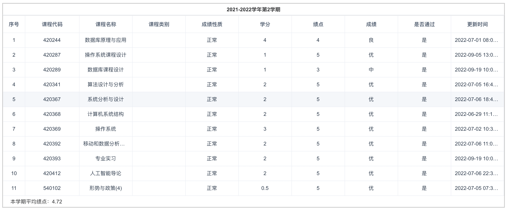
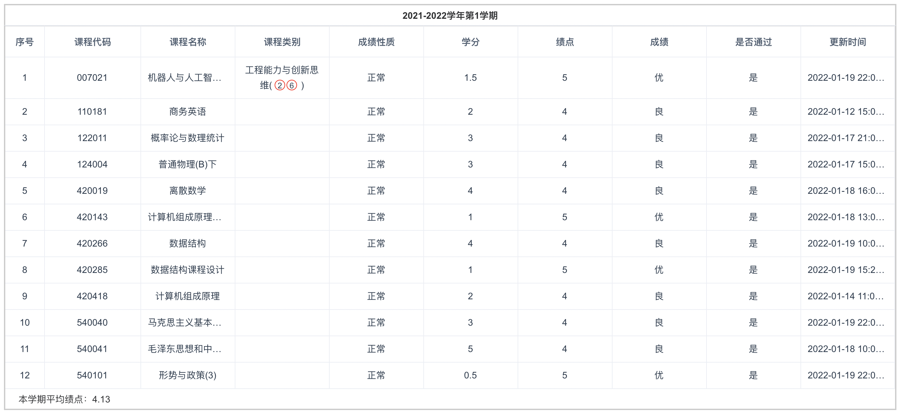
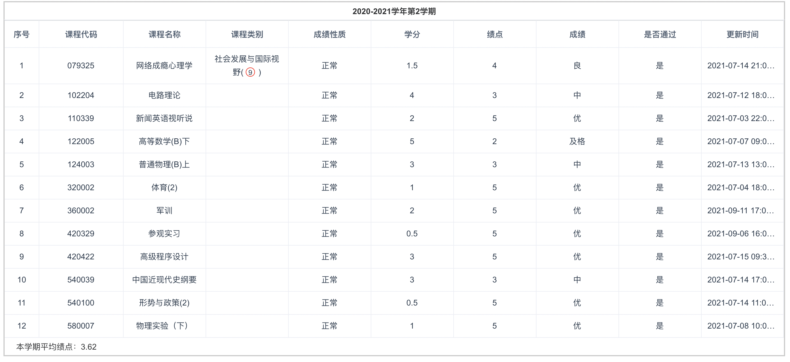
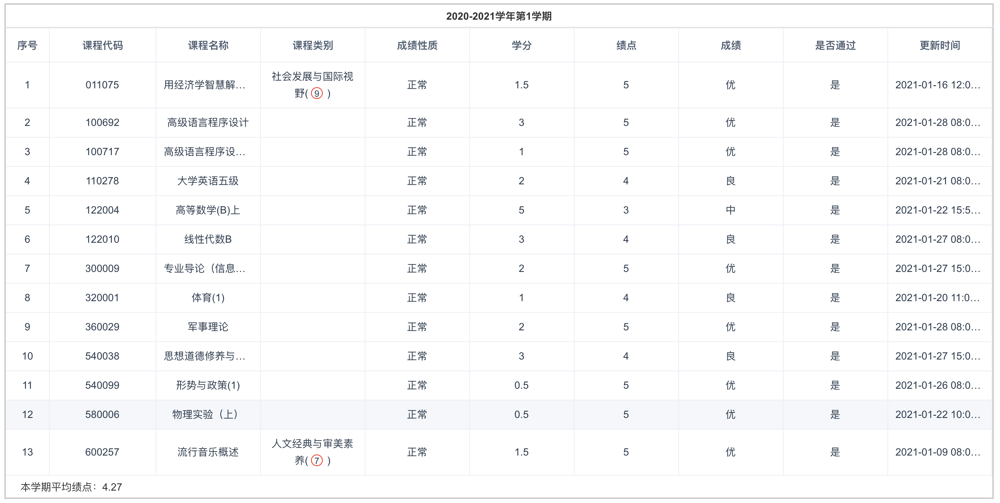
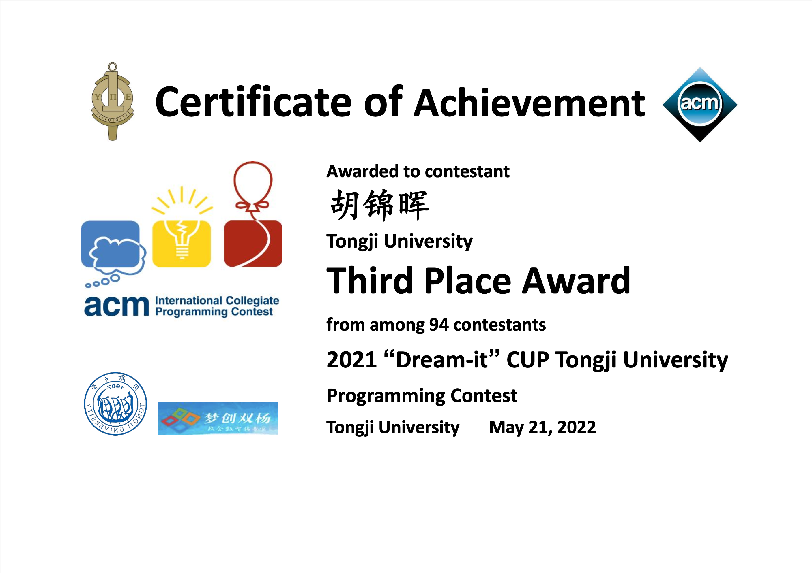

## GPA

四学期总平均绩点：4.16 实修学分：104.00

所有选课如下：

- 2021-2022 第二学期

- 2021-2022 第一学期

- 2020-2021 第二学期

- 2020-2021 第一学期

## 语言

2021-05 CET4：535

2022-09 CET6：暂无成绩

## 其他背景

#### 奖项

- 第十三届蓝桥杯上海赛区C/C++大学A组一等奖

- 第十九届同济大学程序设计竞赛三等奖

#### 主要项目

- SOS在线学习平台（目前可以正常提供服务）

项目地址：[www.venushui.top](http://www.venushui.top)

开发时间：2022-07～2022-09

工作内容：作为项目组组长统筹安排开发任务，同时负责ASP.NET后端开发以及项目前后端及数据库的上云工作
