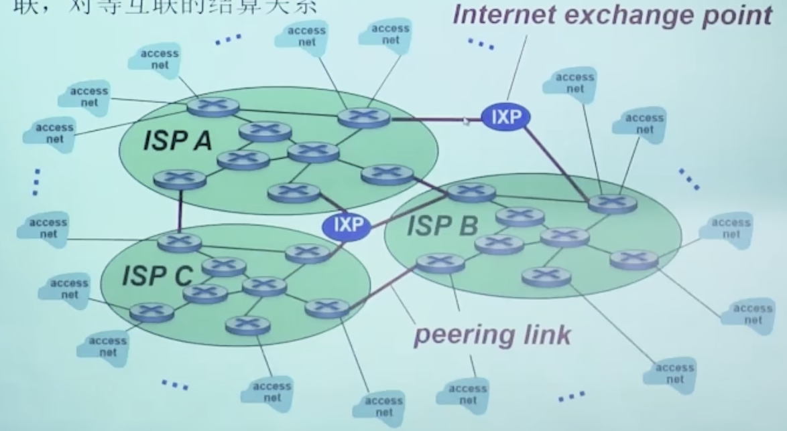
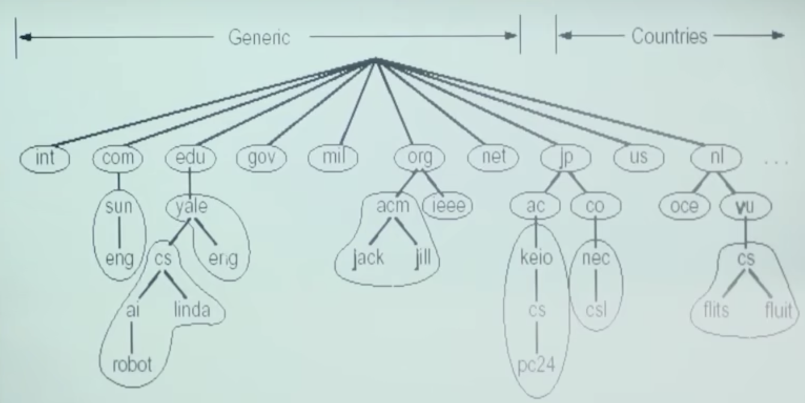
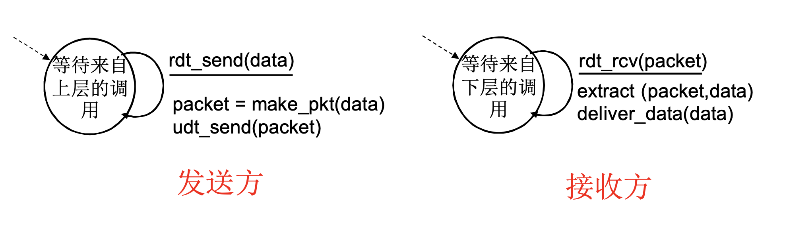
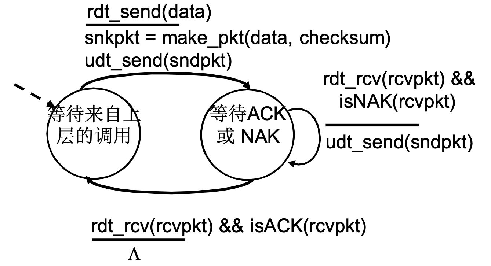
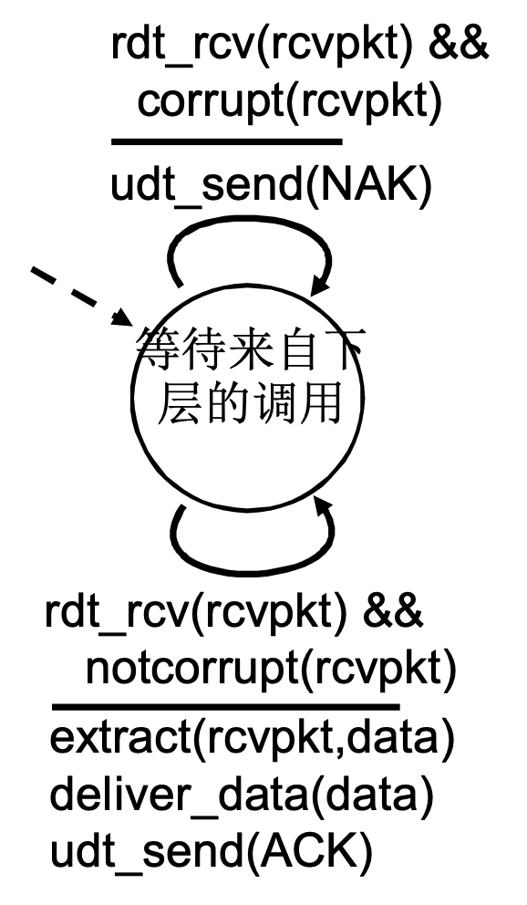
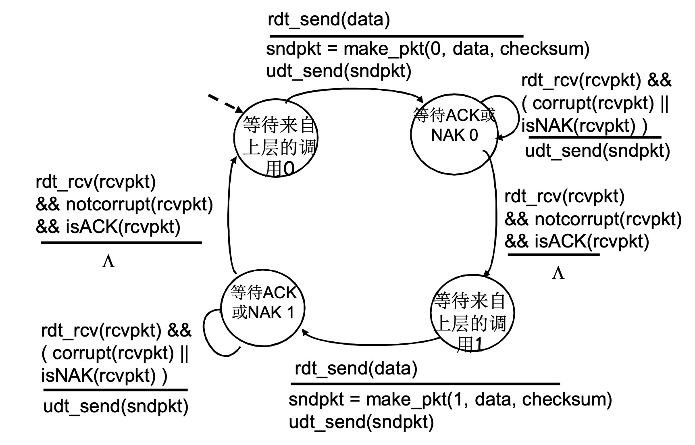
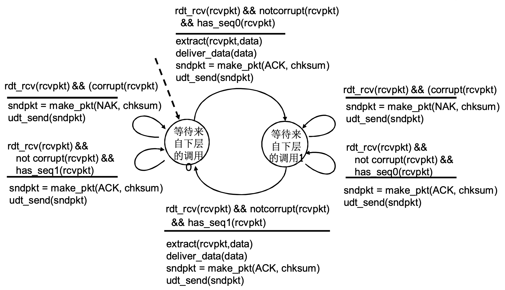
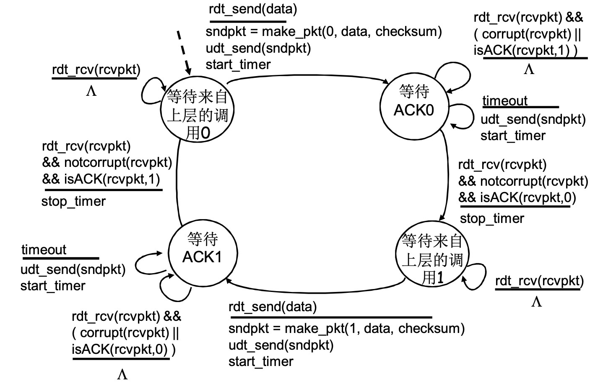
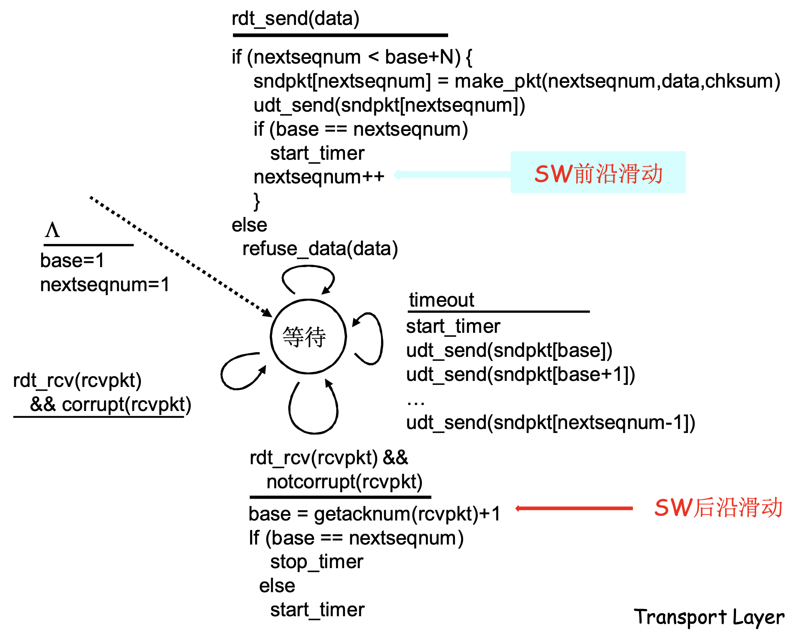
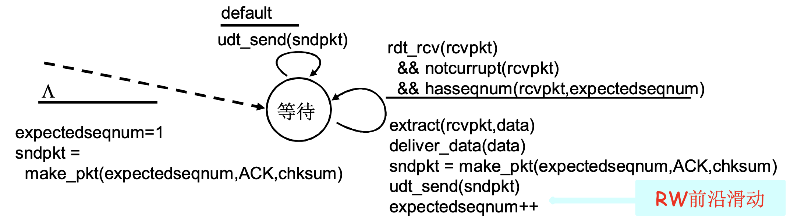

# 计算机网络（自顶向下方法）

>中国科学技术大学 - 郑烇、杨坚
>
>课程视频：[bilibili链接](https://www.bilibili.com/video/BV1JV411t7ow/)
>
>笔记：VenusHui
>
>最后更新：2023.02.26

[TOC]

## 第一章：概论

### 什么是Internet

网络：节点与边之间的关系

计算机网络：

- 节点：
  - 主机节点（数据的源与目标）
  - 数据交换节点（数据的中转节点，如中继器、路由器、交换机）
- 边：通信链路
  - 接入网链路：主机结点到数据交换节点
  - 主干链路：数据交换节点到数据交换节点

- 协议：对等层实体在通信过程中应当遵守的规则的集合，包括语法、语义（即报文格式）、时序和动作，实现了不同网络设备之间的互操作。

互联网：

- 从构成的角度看，使用以TCP协议与IP协议为主的一簇协议的计算机网络
  - IOT时代端系统的种类丰富、数量激增。
  - 公共Internet，专用Intranet
  - Internet标准：
    - RFC: Request For Comments
    - IETF: Internet Engineering Task Force 

- 从服务的角度看，互联网是分布式的应用进程以及（应用层以下）提供通信服务的基础设施。其中基础设施是通过API（如Socket API）向应用进程提供通信服务

> 按照组成的类型，可以将互联网分为以下几个子系统：网络边缘、网络核心以及接入网和物理媒体

### 网络边缘

> 所有的主机以及分布式的应用进程（客户端和服务器）

- 应用进程之间通信的模式：

  - 客户端-服务器 `Client-Server` 模式
    - 是一种主从模式，服务器为主、客户端为从。
    - 服务器：运行在固定的 IP 地址和知名的端口号上。
    - 客户端：主动与服务器进行通信，可能具有动态 IP 地址，不直接与其他客户端通信。
    - 存在的问题：可扩展性差，即随着请求载荷的增加，性能会下降，且当达到一定的阈值之后，性能会断崖式下降。

  - 对等 `Peer to Peer` 模式
    - 对等体：同样是一种分布式的应用进程，在不同的会话中可以充当服务器或客户端。
    - 几乎没有一直运行的服务器，任意端系统之间可以进行通信。
    - 自扩展性：请求资源的节点增多的同时提供资源的节点也在增多，解决了 CS 模式中可扩展性差的问题


- 采用网络设施的面向连接服务

  - 基础设施为网络应用提供通信服务的两种方式
    - 面向连接服务：首先建立连接，底层的协议栈为后续通信准备相应资源、做好标记，通信的状态只在端系统之中维护，网络中的数据交换节点并不维护通信的状态，如 TCP
    - 有连接的服务：通信的状态由端系统和网络中的数据交换节点共同维护
  
  
    - TCP 传输控制协议：
      - 可靠数据传输 `Reliable Data Transfer`：不重复、不丢失、不错误、不乱序，确认及重传机制
      - 流量控制：TCP 协议实体可以根据端系统的数据处理能力协调发送方的发送速率防止发送方淹没接收方
      - 拥塞控制：TCP 协议实体可以根据网络链路的通行能力协调发送方的发送速率，当网络拥塞时降低发送方的发送速率
  


- 采用网络设施的无连接服务

  - UDP 用户数据报协议：
    - 无连接，省去连接时间，适合事务性应用
    - 不可靠，不做维护可靠性的工作，如检错重发等
    - 无流量控制、无拥塞控制，应用能够按照设定的速度发送数据

  - 通常一些实时流媒体应用（实时性要求）以及事务性应用（事务短小，没有必要建立连接）会跑在 UDP 之上

### 网络核心

> 路由器的网状网络，主要作用：数据交换

- 实现数据交换的方式

  - 电路交换：为每个呼叫预留一条专有电路，如电话网
    - 端到端的资源被分配给从源端到目标端的呼叫
    - 首先通过信令系统在网络核心当中为两者的通讯分配一条 **独享** 的线路，每个呼叫一旦建立起来就可以保障性能
    - 每条链路可以通过时分复用 `TDM`、频分复用 `FDM`、波分复用 `WDM` 被分为多条线路 `piece`
    - 如果呼叫没有数据发送，被分配的资源就会被浪费
    - 通常被传统电话网络中使用，不适用计算机之间的通讯
      - 建立通讯时间长
      - 计算机之间的通讯具有突发性，使用线路交换，造成大量资源浪费
      - 可靠性不高：需要维护线路与线路之间的关系，若核心节点被损毁，则会影响大量主机之间的通信
  
  
    - 分组交换（统计多路复用）：
      - 以分组为单位存储、转发
        - 网络带宽资源不再分为一个个片，传输时使用全部带宽
        - 主机与主机之间的通讯被分为一个个分组 `packet` ，在每个数据交换节点中进行存储及转发
      - 资源共享，按需使用
        - 在转发之前，节点必须收到整个分组
        - 存在存储延迟以及排队延迟
        - 如果数据交换节点的缓存用完了，则分组将会被抛弃（过度使用造成的网络拥塞）
  


- 网络核心的关键功能

  - 路由（全局）：决定分组采用的源到目标的路径
    - 路由算法，查路由表

  - 转发（局部）：将分组从路由器的输入链路转移到输出链路

  - 依靠路由和转发的相互配合完成源主机和目标主机的数据交换


- 分组交换按照有无网络层的连接可以分为以下两类：

  - 数据报网络
    - 每个分组都携带有目标主机的完整地址，由目标地址决定下一跳的方向
    - 网络核心对于每个分组都是单独处理的，即在不同的阶段路由有可能改变
  
  
    - 虚电路网络
      - 每个分组并不携带目标主机的完整地址，转而携带所在虚电路的标识（VC ID），由虚电路标识决定下一跳的方向
      - 在呼叫建立时决定路径，且该路径在整个呼叫过程中保持不变
      - 呼叫建立过程中经历的每个交换节点都要维护每个呼叫的状态（有连接，与TCP的面向连接的服务只体现在源主机和目标主机之上不同）
  


### 接入网和物理媒体

> 有线或无线通信链路

#### 接入网

>  端系统和边缘路由器之间的连接方式

- 住宅接入 `modem` 
  - 将上网数据调制加载到音频信号上，在电话线上传输，在局端将其中的数据解调出来，反之亦然
  - 带宽在56kbps及以下，不能同时上网和打电话，不能总是在线。
- 接入网 `digital subscriber line, DSL` 
  - 采用电话线（即调制解调的方式），在距离交换节点较近及线路质量较好时，在保证 0 - 4KHz 的语音通信的情况下，将 4KHz 以上的部分用作网络通信，通常采用不对称的分配方式 `ADSL`，上行速率可以达到 1Mbps，下行速率达到 10Mbps
  - 线缆网络（有线电视公司提供）：通过 `cable modem` 接入到有线电视公司的线缆，再由线缆头端 `headend` 接入互联网
    - 各用户共享到线缆头端的接入网络
    - 非对称带宽划分：30Mbps 下行速率，2Mbps 上行速率
    - 上游光纤，下游同轴电缆
- 企业接入
  - 通过接入点 `access point` 接入到交换机的端口上，通过交换机的级联接入到互联网
- 无线接入：无线局域及无线广域
  - 各无线端系统共享无线接入网络（端系统到无线路由器）
  - 无限广域：由电信运营商提供，由移动设备接入到基站，4G/5G，10km
  - 无线局域：WIFI，大约 100 英尺以内


#### 物理媒体

- 导引性媒体
  - 双绞线 `TP`
  - 同轴电缆
  - 光纤和光缆：误码率低、安全
    - 单模光纤：光信号垂直入射，传播距离远
    - 多模光纤：光信号带有一定角度入射同样满足全反射条件，这种光纤加工难度更高
- 非导引性媒体
  - 无线链路
    - 地面微波
    - LAN（如：WIFI）
    - `wide-area`（如：蜂窝数据）
    - 卫星：同步静止轨道卫星（270msec 延迟）、低轨卫星（如：Mask 星链卫星）

### Internet 结构和 ISP

> 将关系较密集的网络构成的子系统称作一个ISP `Internet Service Providers` 网络

#### 互联网络结构：网络的网络

- 端系统通过 **接入ISP**（如：住宅、公司、学校的ISP）接入到互联网

- **接入ISP** 是互联的：将每个 **接入ISP** 都连接到 **全局ISP** ，**全局ISP** 之间互有合作/竞争

  

- ISP之间的连接方式：

  - POP `Point Of Peering` ：高层ISP面向客户网络的接入点（如regional接入global），涉及费用结算
  
  - 对等接入 `Peering Link` ：两个ISP对等互接，不涉及费用结算
  
  - IXP `Internet Exchange Point` ：多个对等ISP互通互联的地方，通常不涉及费用结算
  
  - ICP `Internet Content Provider` ，如Google）：自己部署专用网络，同时与各级ISP连接 
  
    许多ICP公司选择自己部署数据中心 `Data Center`，通常这些数据中心机房会选择部署在当地ISP附近，各地数据中心通过（租用的 / 自建的）专用线缆连接，减少运营支出，并且向用户提供更优质的服务。

### 性能：分组延时、丢失和吞吐量

> 在路由器缓冲区的分组队列，分组到达链路的速率超过了链路输出的能力就会产生延时，当缓冲区分组队列已满时新到达的分组队列会被丢弃造成分组丢失

#### 分组延时

- 节点处理延时
  - 检查bit级差错
  - 检查分组首部（如：ip处理）、决定分组导向何处（查路由表）
  
- 排队延时
  - 在输出连路上等待传输的时间，依赖于路由器的拥塞程度（流量强度）
  
  - 流量强度 $I$ 
  
    $$
    I = \frac{La}{R}
    $$
    
    其中 $L$ 为分组长度， $a$ 为单位时间希望通过这条链路转发分组的数量， $R$ 为链路带宽
    
    在流量强度趋近于 `0` 时，平均排队延时很小，流量强度趋近于 `1` 时，平均排队延时趋近于无穷大
    
    在系统进行设计时，不允许流量强度大于等于 `1` ，否则不仅排队延时高，而且会出现丢包的情况
  
- 传输延时
  - 将分组发送到链路上的时间 `L/R` ，`L` 为分组长度，`R` 为链路带宽
  
- 传播延时
  - 分组在链路上传播的时间 `d/v` ，`d` 为节点间的距离，`v` 为电磁波传播的速度

`Windows` 可以通过 `Traceroute` 诊断程序诊断每一跳的往返延时 `RTT, Round Trip Time`：

```shell
tracert -d 124.220.158.211
```

诊断通过 ICMP 协议，即互联网控制报文协议实现

#### 分组丢失

由于链路的队列缓冲区容量有限，当一个分组到达一个缓冲区满的队列时，该分组会被丢失

- 分组丢失之后，可能会由
  - 上一跳的交换机重传：链路提供可靠的服务
  - 源主机重传：链路提供不可靠的服务
  - 根本不重传：如 `UDP`

#### 吞吐量

单位时间内从源主机向目标主机传输的有效 `bit` 的数量

- 瞬间吞吐量
- 平均吞吐量

瓶颈链路

- 对于两个主机间的通信，瓶颈链路为该链路上吞吐量最小的一段链路
- 对于实际互联网场景，每一段链路可能由多个通信在使用，瓶颈链路为该链路上吞吐量与链路连接个数之比最小的链路

### 协议层和服务模型

#### 协议层次

通过层次化方式实现复杂网络功能

- 将网络复杂的功能分层成功能明确的层次，每一层实现了其中一个或一组功能，功能中有一些上层可以通过接口使用的功能，即 **服务** 。
- 对等层的协议实体借助下层提供的服务，通过协议交换一些控制信息，执行本层的协议动作，目的是实现本层功能，通过接口为上层提供更好的服务。

#### 服务模型

服务与服务访问点

- 服务 `Service` ：低层实体想上层实体提供他们之间通信的能力。
- 服务访问点 `SAP，Service Access Point` ：下层服务提供者在层间接口用于区分上层不同服务用户的信息，例如，传输层的服务访问点为端口。
- 原语 `primitive` ：上层使用下层服务或下层向上层提供服务的形式，上下层通过服务访问原语进行交互。

服务类型

- 面向连接的服务
- 无连接的服务

数据单元 `DU, Data Unit`

- 服务数据单元 `SDU, Service Data Unit` ：上层要求下层提供的服务数据
- 接口控制信息 `ICI, Interface Controll Information` ：服务数据单元在穿过层间接口时需要添加的控制信息
- `IDU, Interface Data Unit` ：`ICI` + `SDU`

- 协议数据单元 `PDU, Protocol Data Unit` ：在 `IDU` 穿过层间接口后，取出其中的 `SDU` ，（对 `SDU` 进行分割或组合后，）在头部加上本层的相关控制信息（一部分由 `ICI` 转化而来，一部分由本层直接添加）后，形成本层的 `PDU` ，每一层的 `PDU` 都有各自的特定的称呼
  - 应用层：报文 `message`
  - 传输层：报文段 `segment` ：TCP段、UDP数据报
  - 网络层：分组 `packet` 、数据报 `datagram`
  - 链路层：帧 `frame`
  - 物理层：位 `bit`

#### Internet 协议栈

- 应用层：为人类用户或其他应用进程提供网络应用服务
- 传输层：对同一主机进程与进程之间进行区分，并将网络层不可靠的服务转换为可靠的
- 网络层：在源主机与目标主机之间（端到端）传输以分组为单位的数据
- 链路层：在相邻两点之间传输以帧 `frame` 为单位的数据
- 物理层：在线路上传送 `bit` 

#### ISO/OSI 参考模型

在应用层与传输层之间添加了表示层与会话层，这两层在 Internet 协议栈中都是交给应用层去做的

- 表示层：允许应用解释传输的数据，如加密、压缩等
- 会话层：数据交换的同步，检查点，恢复

### 历史

## 第二章：应用层

> 完成不同端系统之上两个应用进程之间的远程通信

### 应用层协议原理

进程：在主机上运行的应用程序

分布式进程通信需要解决的问题：

#### 进程标识和寻址

- 通过主机 `IP` 和端口号共同标识一个端节点，本质上一对主机进程之间的通信

- 部分端口用于TCP；部分端口用于UDP 

#### 传输层如何向应用层提供服务

> 位置：层间界面的服务访问点 `SAP`  `TCP/IP: socket`
>
> 形式：应用程序接口 `TCP/IP: socket API`

层间接口必须携带的信息：

- 要传输的报文：`SDU`
- 我方应用进程的标识（谁传的）：`IP` +端口号
- 对方应用进程的标识（传给谁）：`IP` +端口号

`socket`：为便于管理，并减少穿过层间接口的信息量，用一个 **整数** 来标识一个应用实体或两个应用实体之间的通信关系。

- `TCP socket`：对于使用 `TCP` 服务的应用进程而言，`TCP socket` 是 `源IP、源端口、目标IP、目标端口` 这一四元组的 **本地意义** 的整数标识，唯一指定了一个两个应用进程之间的会话关系
- `UDP socket`：对于使用 `UDP` 服务的应用进程而言，`UDP socket` 是 `本地IP、本地端口` 这一二元组的本地意义的整数标识，用于标识本应用进程。传输报文时需要提供对方 IP 及端口号，接收报文时传输层需要上传对方 IP 及端口号

传输层实体 `TCP/UDP实体` 根据这些信息进行 `TCP报文段/UDP数据报` 的封装:

- TCP：TCP的段头+数据部分

#### 应用层如何使用传输层提供的服务

> 定义应用层协议：包括报文格式、解释、时序等
>
> 编制程序，使用操作系统提供的 `API` 调用网络基础设施实现应用

- 应用层协议：定义了运行在不同端系统上的应用进程如何相互交换报文，包括报文的类型、语法、语义、规则。应用层协议仅仅是应用的一部分

- 传输层服务的性能指标：数据丢失率、延迟、吞吐、安全性
  - 安全性：`SSL`，`HTTPs` 是跑在跑在 `TCP` 之上的 `SSL` 之上的 

### Web和HTTP

#### Web

- 含有一个基本的 HTML 文件，该文件又包含了通过 `URL` 对若干对象的引用

- `URL` ：通用资源定位符 `Universal Resources Locator` ，格式：协议名+用户:口令+主机名+路径名+端口
  - 匿名访问：不提供用户名及口令
  - 一些知名协议具有默认的端口，如 HTTP 的 80 端口等

#### HTTP

> Hyper Text Transport Ptotocol 超文本传输协议

- 使用 TCP
  - `waiting socket` ：守候在服务器的 80 端口，监听 HTTP 请求（TCP 连接）
  - `connection socket` ：成功建立的连接
- 无状态：服务器不需要维护客户端的状态
- HTTP 连接
  - 非持久 HTTP：最多只有一个对象在 TCP 连接上发送，即下载多个对象需要多个 TCP 连接，HTTP/1.0: RFC1945 默认使用非持久连接
  - 持久 HTTP：多个对象可以在一个 TCP 连接上传输，即对于客户端向同一个服务器不同对象的请求可以不用关闭 TCP 连接再重启，持久 HTTP 连接对于多个对象请求的处理有流水线和非流水线两种形式。HTTP/1.1: RFC2068 默认使用持久连接

- 响应时间模型

  - `RTT Round-Trip Time` ：往返时间

- HTTP 报文

  - 报文 ASCII 可读

  - 请求报文

    ```
    [method] sp [url] sp [version] cr lf		请求行
    [header field name]:[value] cr lf
    ……
    [header field name]:[value] cr lf		若干个首部行
    cr lf
    Entity Body
    ```

  - 响应报文

    ```
    [协议版本] sp [状态码] sp [状态信息] cr lf		状态行
    [header field name]:[value] cr lf
    ……
    [header field name]:[value] cr lf		若干个首部行
    cr lf
    [data]
    ```

  - 需要自己维护报文之间的边界

- Cookies：服务器用于维护客户端状态的工具

  - 在 HTTP 响应报文中有一个 cookie 的首部行
  - 在 HTTP 请求报文中有一个 cookie 的首部行
  - 在用户端系统中保留有一个 cookie 文件，由用户使用的浏览器管理
  - 在 Web 站点有一个后端数据库存储分配的 cookie

- Web缓存（代理服务器 proxy）
  - 不访问原始服务器来满足客户端的需求，通常由 ISP 建立
  - 能够一定比例的满足本地用户的访问请求
  - 目的：降低客户端的请求响应时间、降低服务器负载、减少网络链路载荷
  - `Conditional Get` 条件获取，解决本地 Web 缓存与服务器资源一致性的问题，增加 `If-modified-since:<date>` 字段，在 HTTP 请求中指定缓存拷贝的日期，如果缓存对象未被修改，则返回 `304 Not Modified` ；否则返回修改后的对象

### FTP

> File Transport Protocol 文件传输协议
>
> 向远程主机上传输文件或从远程主机接收文件，是有状态协议（服务器需要维护客户端的状态）

- RFC 959

- FTP 服务器：**21 号端口**

- 文件传输过程

  - 控制连接：客户端向服务器 21 号端口请求控制连接，用于身份认证，发送浏览、下载文件的相关命令

    ```
    # 命令
    USER username
    PASS password	// 身份认证
    List					// 远程主机当前目录的文件列表
    RETR filename // 从远程主机的当前目录下载文件
    STOR filename // 向远程主机的当前目录上载文件
    
    # 返回（状态码和状态信息，与 HTTP 类似，举例如下）
    331 Username OK, password required
    125 data connection already open; transfer starting
    ```

  - 数据连接：服务器 20 号端口向客户端请求数据连接，用户服务器在接到下载命令后向客户端传输文件

    - 主动模式使用 20 号端口
    - 被动模式由服务器和客户端协商决定使用的端口

### Email

> 发送协议：SMTP（简单邮件传输协议）
>
> 拉取协议：POP3、IMAP、HTTP 等

#### 组成部分

- 用户代理：撰写邮件的客户端软件，如：OutLook等，用户借助用户代理通过拉取协议从邮件服务器的邮箱中拉取邮件
- 邮件服务器：25 端口
  - 邮箱：管理和维护发送给用户的邮件，每个邮件服务器维护多个用户代理的邮件信息
  - 输出报文队列：保持带发送邮件的报文
- 简单邮件传输协议 SMTP：发送 email 报文
  - 客户端：发送方邮件服务器
  - 服务器：接收方邮件服务器

#### SMTP

- RFC 2821

- 使用 TCP **25 号端口** 传输报文

- 直接传输：从发送方服务器到接收方服务器

  - 握手
  - 传输报文（使用 **持久连接**，一次连接可以发送多封邮件）
  - 关闭

- 命令/响应交互

  - 命令：ASCII 文本

    ```
    HELO
    MAIL FROM
    RCPT TO
    DATA
    QUIT
    ```

  - 响应：状态码和状态信息

- 报文必须为 7 位 ASCII 码形式，格式由 RFC 822 规定

  ```
  首部行
  	To:
  	From:
  	Subject:
  空行
  主体
  ```

- MIME 多媒体邮件扩展 `multimedia mail extention`

  - RFC 2054，RFC 2056

  - 在报文首部用额外的行声明 MIME 内容类型

    ```
    MIME-Version: 1.0
    Content-Transfer-Encoding: base64 // base64 编码将一些不在 ASCII 范围内的字节映射到稍长一些的在 ASCII 范围内的字节
    Content-Type: image/jepg
    ```

#### 邮件访问协议

- 邮局访问协议 `POP, Post Office Protocol`

  - RFC 1939

  - 用户确认阶段：客户端向服务器提供用户名和密码

    ```
    # 客户端命令
    user
    pass
    
    # 服务器响应
    +OK
    -ERR
    ```

  - 事务处理阶段

    ```
    # 客户端命令
    list	报文号列表
    retr	根据报文号检索报文
    dele	删除
    quit	关闭连接
    ```

  - 具有 *下载并删除* 和 *下载并保留* 两种模式

  - POP3 在会话中是无状态的

- Internet 邮件访问协议 `IMAP, Internet Mail Access Protocol`

  - RFC 1730
  - 相较于 POP3 拥有更多特性，如：远程目录维护
  - IMAP 在会话中保留用户状态

- HTTP

  - 相对方便

### DNS

> Domain Name System 域名解析系统，完成域名到 IP 地址的转换

- UDP **53 号端口**
- DNS 主要目的
  - 实现主机名到 IP 地址的转换
  - 实现主机别名到规范名的转换 `Host aliasing` 
  - 负载均衡
  - 域名解析重定向（在 DNS 服务器中配置）
  
- DNS 的必要性：用有意义的字符串来标识 Internet 中的设备

#### 设备命名

> 层次化命名

- Internet 被划为几百个顶级域 `top level domains` 
  - 通用：`.com` , `.edu` , `.int` , `.org` 
  - 国家：`.cn` , `.us` , `.jp` 
- 每个顶级域下可被划分位若干子域 `subdomains` ，如： `.gov.cn` ,`.edu.cn`，其他层级域的划分以此类推
- 根名字服务器：全球共有 13 个根名字的服务器
- 一个域管理其下的子域；域的划分是逻辑的，与物理网络无关

#### 工作原理 

> 分布式

- 区域 `zone`

  

  - 将 DNS 名字空间（抽象为一棵树）划分为互不相交的区域，每个区域都是树的一部分，区域的划分由域的管理者自己决定
  - 每个区域都有一个权威 DNS 服务器，维护其所管辖区域的 **权威信息** `authoritative record` ，也就是一般不修改的信息，资源记录的 `ttl` 字段通常为无穷大

- TLD 服务器

  - 顶级域 TLD 服务器：负责顶级域名和所有国家级的顶级域名，如：Network Solutions 公司维护 `com` TLD 服务器

- 区域名字服务器维护资源记录

  - 资源记录 `resource records` ，在名字服务器的分布式数据库中维护域名到 IP 地址的映射关系

  - RR 格式

    ```
    Domain_name // 域名
    Ttl					// 资源记录应当从缓存中删除的生存时间（权威记录、缓冲记录），权威记录的 TTL 为无穷大
    Class				// 类别，对于 Internet，Class值为 IN
    Value				// 值，可以是域名、数字或 ASCII 串
    Type				// 资源记录的类型（除了域名到 IP 的转换，还可能维护主机别名到规范名的转换等）
    						// Type = A，主机 - IP地址
    						// Type = NS，域名 - 该域名权威服务器的域名，相当于向上层走的指针
    						// Type = CNAME，别名 - 规范名字
    						// Type = MX，邮件服务器别名 - 邮件服务器规范名
    ```

- 工作过程

  - 应用调用解析器 `resolver` 
  - 解析器作为客户通过 UDP 向名字服务器发出查询报文
    - 解析器需要手动或通过 DHCP 自动配置名字服务器的 IP，配置过后这台名字服务器就是 `Local Name Server` 本地名字服务器，也称默认名字服务器
    - 每个 ISP 都有一个本地名字服务器
    - 当一个主机发起一个 DNS 查询时，查询便被送到本地名字服务器
      - 若本地名字服务器有该条记录的缓存，则返回查询结果
      - 若本地名字服务器无法解析，该服务器起到代理作用，将查询转发到区域层次结构的根名字服务器中，递归查询或迭代查询直到查询到结果。
      - 不建议使用递归查询的原因：根服务器负载太重
      - 迭代查询工作流程：根级各级域名返回的不是查询结果，而是下一个 `Type = NS` 的权威服务器的地址，如此迭代最后由权威服务器给出解析结果
  - 名字服务器返回响应报文 

- 报文格式

  DNS 协议查询报文和响应报文的报文格式相同

  ```
  # 报文首部
  [identification][flags] // identification 为 16 位标识符，使得 Name Server 可以同时维护许多查询
  												// flags 规定了：查询/应答，递归/迭代，递归可用，应答是否权威等信息
  												
  # 报文主体
  ```

- 通过缓存的方式提高性能，一但名字服务器 *学到* 了一个映射，就将该映射缓存起来，默认 `TTL` 值为两天

#### 维护域名系统

- 新增一个域
  - 在上级域的名字服务器中添加两条资源记录，`Type = NS` 指向新增子域的域名和 `Type = A` 指向新增子域的域名服务器的地址
  - 新增子域的名字服务器来维护子域内的域名信息
- DNS 的安全性
  - DDos 攻击
    - 对跟服务器进行流量轰炸攻击
    - 向 TLD 服务器进行流量轰炸攻击
  - 重定向攻击
    - 中间人攻击：截获查询，伪造回答
    - DNS 中毒：发送伪造的应答给 DNS 服务器，希望它能缓存这个虚假的结果
  - 总的来说，DNS 比较健壮

### P2P 应用

> Peer To Peer 对等模式
>
> 可扩展性相较于 CS 模式强得多，但相较于 CS 模式更难管理

- 覆盖网 `overlay` ：Peer 之间的逻辑网络

#### 非结构化 P2P

> 非结构化 P2P 的覆盖网是任意的

- 集中化目录

  - 每个节点上线和下线时向集中目录服务器注册：节点 IP 和节点所具有的资源
  - 节点查询时向集中目录服务器发送查询请求，由集中目录服务器给出资源所在节点的相关信息，由请求节点与给出的节点建立 TCP 连接进行传输
  - 存在的问题
    - 单点故障：集中目录服务器故障则系统无法运行
    - 性能瓶颈：上下线向集中目录服务器注册可能存在性能瓶颈
    - 版权问题：集中目录服务器无法控制节点所具有的资源是否符合版权规范‘

- 完全分布式

  - 没有中心服务器，在所有节点之间建立覆盖网 `overlay` ，通常一个节点所连接的对等方节点数量小于 10

  - 查询泛洪 `flooding`

    - 节点针对某一资源向覆盖网中所有与其相连的邻居节点发送查询请求，邻居节点在收到查询请求后重复上述操作，直到拥有该资源的节点进行响应，再由原查询节点选择返回了响应的节点建立 TCP 连接进行资源的传输
    - 防止泛洪的方法：设置 TTL、维护已经查询过的节点防止重复查询

  - 覆盖网的建立

    - 在 P2P 应用安装时通常会有相应的配置文件存储了数个经常在线的 *死党节点* 的 IP
    - 要加入覆盖网的节点先向配置文件中预设的死党节点发出 `ping` ，所有收到 `ping` 的节点向发出节点回应 `pong` ，同时向其所有邻居节点转发 `ping` ，最后要加入覆盖网的节点在所有收到的 `pong` 中随机选择 8 到 10 个节点并通过相应 P2P 应用的协议建立连接从而加入覆盖网
    - 要退出覆盖网的节点向其所有邻居节点发送退出请求后下线，收到退出请求的节点需要从覆盖网中随机选择一个节点进行补充，保证节点的度可以维持在覆盖网中的正常运行

- 混合型

    - 每个对等体要么是一个组长，要么隶属于一个组长
    - 组长与其所有组员的关系为集中化目录关系
    - 组长与其他组长的关系为完全分布式关系
    - 查询细节：每个文件在上载时除了元数据外还需要附加一个文字描述以及一个散列值，用户搜索时匹配描述，对等体查询时匹配散列值，散列值为该文件的唯一标识
- 举例 `BitTorrent` 
    - 一个文件被分为若干长度一致的部分，洪流中的每个节点都维护一个关于该文件的 `bitmap` ，对于 `bitmap` 的每一位而言，节点拥有该位对应的文件部分则该位置 `1` ，否则置 `0` ，相当于对文件进行状态压缩
    - 当一个节点加入该洪流，即该节点对于该文件的 `bitmap` 为 `0` 时，节点首先请求洪流中所有节点关于该文件的 `bitmap` ，并随机选择 4 个部分进行下载，当 `bitmap` 中有 4 位被置为 `1` 之后，该节点分析之前请求的其他节点的 `bitmap` 并选择洪流中对于该文件的 **稀缺部分** 进行下载，这样做的好处是：
        - 由于持有稀缺部分的节点数量较少，容易发生这些节点全部下线的情况，这样洪流中的该文件则不完整了（迅雷经常出现下载 99.9% 的原因）
        - 由于该节点持有了洪流中该文件的稀缺部分，则其他想要下载该文件的节点访问该节点的流量与带宽也会增加，根据 P2P 模式的特性，其他节点在下载时也可以向该节点提供上载服务，所以该节点获得的流量与带宽也会增加，从而下载其他资源的性能也会随之增加
    
    - 优化疏通：从资源提供方的角度来看，由于提供方的上载带宽有限，只能同时向特定数量的节点提供服务，若请求的节点数量超过该数量，则需要排队；排队的优先级根据上一次泛洪周期中排队节点对于提供方节点的服务质量进行评估
    - 震荡疏通：在有限疏通特定个周期后，需要进行震荡疏通，即资源提供方节点随机选择一个节点将其作为排队优先级最高的节点对其进行服务，这样可以有效减少其他节点可能出现的饥饿情况，增加整个洪流的上下载带宽
    - 节点加入洪流：带外解决（一个连接内传输为带内，分两个连接传输为带外）
        -  `Torrent` 文件：维护了文件资源与跟踪服务器 `Tracking Server` 之间的对应关系，`Torrent` 文件在检索网站中维护
        - `Tracking Server` ：维护了文件资源与洪流之间的对应关系
        - 节点通过向 `Tracking Server` 发送加入请求，`Tracking Server` 向该节点返回维护欲查询文件的节点列表（洪流），之后进行上面节点加入洪流的过程
    

#### DHT 结构化 P2P

> 结构化 P2P 的覆盖网构成 **环** 、**树** 等有序拓扑关系

- 每个节点以自己 IP 地址的散列值作为一个唯一标识，覆盖网按照该标识形成有序拓扑
- 在有序拓扑中，选择一些节点来维护所辖节点的文件资源目录
  - 举例：环状拓扑：根据散列值从小到大形成环状覆盖网，其中某一散列值范围内的节点的目录由其中一个节点来维护，在环外有节点想要获取该文件则首先找到该节点，再通过该节点获取文件目录
  - 优势：避免泛洪，通过某种约定的方式（有序的拓扑结构）来维护文件资源，可以使查询节点很快找到欲查询文件所在的节点位置，所以没有必要保存很多数量的文件副本，可以有效减少文件资源的副本数量

### CDN

> Content Distribute Network 内容分发网络

多媒体，尤其是视频占据互联网中超过 70% 的带宽，由于视频每一帧图像内部存在空间上的冗余，帧与帧之间又存在时间上的冗余，所以通常通过视频编码将视频压缩后再进行传输，常见的压缩方式有：

- `CBR, constant bit rate` ：以固定速率编码
- `VBR, variable bit rate` ：视频编码速率随时间的变化而变化，例如：场景变化时视频的瞬时码率就会很高）
- 常见的压缩标准：`MPEG1` ，`MPEG2`，`MPEG4`

`DASH, Dynamic Adaptive Streaming over HTTP` 多媒体流化服务

- 可以实现视频边下载边播放

- 服务器：预先部署

  - 将视频文件分割成若干个 8 到 10 秒的编码块
  - 每个编码块独立存储（可以存储在不同的服务器中），编码于不同码率：`360p` 、`1080p` 等等
  - 维护一个 `manifest file` 告示文件，其中包含有不同编码块的 URL

- 客户端点播一个视频文件的过程

  - 首先获取告示文件
  - 在播放的同时将下一个编码块下载到缓冲区中
  - 客户端自适应决定请求编码块的码率：周期性的测量服务器到客户端的带宽情况，并且根据带宽情况、缓冲区中已缓冲的时长、设备需求等情况切换请求不同的编码块

`Mega-Server` 存在的问题

  - 服务器到客户端路径上跳数较多，瓶颈链路的带宽不足导致卡顿

  - 奇普夫分布导致网络中同时充斥着同一个视频的多份拷贝，效率低下

  - 存在单点故障问题和性能瓶颈
  - 可扩展性差

`Content Distribute Network` 

- CDN 运营商在全网部署缓存节点，ICP 通过预先部署将视频内容投放到缓存节点当中，用户客户端通过域名解析的重定向访问距离用户最近、网络状况最好（或根据其他策略）的 CDN 缓存节点获取视频内容
- 缓存服务器的部署策略
  - `enter deep` ：将 CDN 缓存节点深入到许多接入网，在 `local ISP` 附近部署
    - 更接近用户，提供的服务质量更好
    - 需要部署的节点数量更多，管理和维护也更加困难
  - `bring home` ：将 CDN 缓存节点部署到关键位置，即上层 `ISP` 节点、数据中心机房附近
- `over the top` ：在应用层将主机（缓存节点）之间的通信作为一种内容加速服务提供给用户

### TCP Socket 编程

> 可靠的、字节流的服务

TCP socket的工作流程

- 服务器端进程先运行，等待连接建立
  - 创建 `welcome socket`，与本地端口捆绑
    - 不能是隐式捆绑，否则客户端无法得知服务端的端口号
  - 在 `welcome socket` 上阻塞式等待接受用户的连接
    - `accept()` 函数阻塞
- 客户端主动和服务器建立连接
  - 创建客户端本地socket，隐式捆绑到一个本地端口
  - 指定服务器进程的 IP 地址和端口号，阻塞式与服务器进程连接
    - `connet()` 函数阻塞
- 当客户端连接请求到来时
  - 服务器接收来自用户端的连接请求，解除阻塞式等待，返回一个 `connection socket` 与客户端建立通信
  - `connection socket` 与 `welcome socket` 不同，前者包含了客户端的 IP 和端口号信息，维护服务器与这一客户端的会话，而后者则仍然在之前捆绑的本地端口进行阻塞式等待，所以一个服务器可以连接多个客户端，不同 `connection socket` 的信息通过客户端 IP 和端口号进行区分

数据结构

- `sockaddr_in` ：描述 IP 地址和端口捆绑关系的数据结构，即通信中的一个端节点

  ```c
  struct sockaddr_in {
    	short sin_family;	// AF_INET 地址簇（可以用于 TCP/IP 或 IPX）
    	u_short sin_port; // 端口号
    	struct in_addr sin_addr; // IP 地址
    	char sin_zero[8]; // align 起到对其作用
  }
  ```

- `hostent` ：描述域名和 IP 地址的数据结构

  ```c
  struct hostent {
    	char *h_name; // 主机域名
    	char **h_aliases; // 主机一系列别名
    	int h_addrtype;
    	int h_length;	// 地址长度
    	char **h_addr_list; // IP 地址的列表
    	#define h_addr haddr_list[0]; // 将 IP 地址列表中下标为 0 的 IP 作为解析得到的 IP
  }
  ```

  解析后得到的 IP 地址拷贝到 sockaddr_in 的 IP 地址部分

### UDP Socket 编程

> 不可靠 `UDP 数据报` 服务

- 没有连接，没有握手
- 每一份报文中必须指定接收方的 IP 地址和端口号
- 服务器必须从收到的分组中提取出发送端的 IP 地址和端口号
- UDP 传送的数据可能乱序，不可靠

UDP socket 的工作流程

- 服务器端：
  - 创建 `socket`，与本地端口捆绑
  - `recvfrom()` 函数阻塞式等待读取客户端发送的数据报，同时获取客户端的 IP 地址和端口号
  - `sendto()` 函数向之前获取的客户端的 IP 地址和端口号发送数据报

- 客户端
  - 创建 `socket`，隐式捆绑到一个本地端口
  - `sendto()` 函数向应用程序制定的 IP 和 UDP 端口号发送数据报
  - `recvfrom()` 函数阻塞式等待读取服务器端发送的数据报

## 第三章：传输层

### 传输层服务概述

> 提供应用进程之间的、以报文为单位的逻辑通信服务

- 传输层协议运行在端系统
  - 发送方：将应用层的报文分成报文段，然后传递给网络层
  - 接收方：将报文段重组成报文，然后传递给应用层
  - Internet 的传输层协议：TCP、UDP
- 网络层提供了主机之间的逻辑通信服务
  - 传输层的服务依赖于网络层的服务，所以传输层无法对传输延时、带宽等服务进行增强
  - 传输层的服务对网络层的服务进行增强，可以解决数据丢失、顺序混乱和安全性等问题

### 多路复用和解复用

> 通过划分端口，在发送方主机多路复用，在接收方主机多路解复用

- TCP
  - 应用层向传输层提供 `TCP socket` 和要传输的信息 `message`
  - TCP 协议实体将 `TCP socket` 携带的源端口和目标端口信息作为段头，连同 `message` 封装成 `TCP segment` ，并将该`TCP segment` 连同  `TCP socket` 携带的源主机和目标主机信息提供给网络层
  - 网络层的 IP 协议实体将源主机和目标主机信息作为分组头，连同 `TCP segment` 封装成 `packet` 发送给接收方的对等层实体
  - 接收方在收到 `packet` 之后，类似的通过上面的过程解复用，最终在应用层可以获取到源主机、源端口、目标主机、目标端口以及要传输的信息 `message` ，通过前四个信息可以唯一确定一个 `TCP socket` ，对应着某一个应用进程，即该应用进程的到要传输的信息 `message`
- UDP
  - 应用层向传输层提供 `UDP socket` 、要传输的信息、目标端的主机和端口号的结构体 `sockaddr_in` 的指针
  - UDP 协议实体将相应信息封装为 `UDP datagram` ，连通源主机和目标主机提供给网络层，后续操作与 TCP 类似

### 无连接传输 UDP

> UDP, 用户数据报协议 User Datagram Protocol [RFC 768]

- UDP 的特点

  - `best effort` 尽力而为的服务，报文段可能丢失、乱序
  - 无连接：发送端与接收端没有握手，每个 UDP 报文段都被独立的处理
  - 通常用于：流媒体（丢失不敏感但速率敏感）、DNS、SNMP（SDN 控制器南向接口协议）
  - 在 UDP 上实现可靠传输需要在应用层增加可靠性

- 报文段格式

  ```
  # 头部，共 8 个字节，每个部分占 2 个字节
  [源端口号] [目标端口号]
  [长度] [校验和]
  
  # 应用程序数据，即报文
  ```

  - 校验和 `EDC` ，差错控制编码：判断 UDP 数据报在传输过程中是否出错
    - 源端：将报文段的内容视为 16 bit 的整数，校验和就是报文段内容的加法和的反码，注意做加法时最高位的进位需要回卷，即将最高位的进位加到最低位上
    - 目标端：计算报文段的校验和，并与报文段中校验和字段进行比较，即`校验范围 + 校验和 = 0xffff`，不相等则出错，相等也有可能出现残存错误
  - 报文头部开销很小：8 个字节
  - 无拥塞控制和流量控制：可以尽可能快的发送报文段

### 可靠数据传输 RDT 的原理

> RDT, 可靠数据传输 Reliable Data Transfer Protocol

- 描述约定：

  - 由于双向的数据传输实际上是两个单项数据传输问题的综合，所以这里描述时只考虑单项数据传输，但控制信息是双向流动的

  - 使用有限状态机 `FSM` 来描述发送方和接收方
    $$
    \frac{引起状态变迁的事件}{状态变迁时采取的动作}
    $$

#### 在可靠信道上的可靠数据传输

> 下层的信道是完全可靠的，没有比特出错、没有分组丢失

##### `RDT 1.0`



发送方封装，接收方解封装

#### 具有比特差错的信道

> 下层的信道可能会出错：将分组中的比特翻转

##### `RDT 2.0`

- 用校验和来检测比特差错
- 从差错中恢复
  - `ACK, acknowledgement` ：接收方显示地告诉发送方分组已被正确接收
  - `NAK, negative acknowledgement` ：接收方显示地告诉发送方分组发生了差错，发送方收到 `NAK` 后需要重传分组

- 发送方 FSM 描述

  

  - $\Delta$ 表示不采取任何动作

- 接收方 FSM 描述

  

  - `corrupt()` 函数判断校验码是否正确，返回 `true` 则校验码错误

- 存在的问题：`ACK` 和 `NAK` 也有可能出错

##### `RDT 2.1`

- 引入 **序号机制**，发送方在每个分组中加入序号，若 `ACK / NAK` 出错，发送方则重传当前分组，接收方在收到重复序号的分组则将该分组丢弃

- 发送方 FSM 描述

  

  - 这里的 `0` 、 `1` 为分组序号， `0` 为前一个分组、 `1` 为后一个分组，并且由于是 `stop and wait` 协议，只需要一个 bit 位代表分组序号

- 接收方 FSM 描述

  
  
  - 这里的 `ACK / NAK` 本身也携带了校验码，用来检测是否出错
  - `has_seq0/1()` 函数判断接收到分组的序号是否为 `0 / 1` 
  - 注意这里在收到正确但非期望序号的分组后，需要向发送端返回 `ACK` ，这样发送端才会发送下一个分组，但收到错误且非期望序号的分组后，仍然向发送端返回 `NAK` 
  - 接收方并不知道它最后发送的 `ACK / NAK` 是否被正确的收到

##### `RDT 2.2` 

- 只使用 `ACK` ：对 `ACK` 编号，在 `RDT 2.1` 中，`NAK1` 与 `ACK0` 起到的作用是一样的，即对前一个分组的正向确认与对当前分组的反向确认起到的作用是一样的，所以可以将 `NAK` 优化掉
- 好处
  - 在扩展分组序号之后则可以支持一次性发多个分组
  - 同一个分组的确认信息从 `ACK & NAK` 减少到 `ACK + Seq` ，确认信息减少一半，协议处理较为简单
- 其他细节与 `RDT 2.1` 相同

#### 具有比特差错和分组丢失的信道

> 下方的信道可能出错：传输的分组可能丢失

##### `RDT 3.0`

- 解决方案：超时重传机制

  - 超时时间的设置：链路层的 `timeout` 时间是确定的；传输层的 `timeout` 时间是自适应的
  - 重传可能会导致数据重复，但 `RDT 2.1` 中的序号机制已经解决了数据重复问题

- 发送方 FSM 描述

  

  - `start_timer()` ：启动超时定时器；`stop_timer` ：结束超时定时器
  - 在 `等待 ACK1` 状态时：收到 `ACK0` 与 `timeout` 的效果时一样的，都是重发 `sndpkt` ，所以收到 `ACK0` 下面出现了 $\Delta$

- `timeout` 时间设置不合理的问题（过早超时）：可以正常工作，但可能会出现多次重复发送，导致效率降低

- `RDT 3.0` 是完备的，但作为一个 `stop and wait` 协议，在信道容量较大时有着较为严重的低效率问题，网络协议限制了物理资源的利用

#### 流水线：提高链路的利用率

- 流水线协议 `pipeline` ：与 `stop and wait` 协议不同的是，`pipeline` 协议允许发送方在未得到对方确认的情况下一次发送多个分组
  - 需要增加序号的范围，用多个 bit 表示分组的序号
  - 发送方和接收方需要设置缓冲区，发送方缓冲未收到确认的分组，可能需要重传；接收方缓存接收到的分组，由于接收到的数据可能乱序，需要在缓冲区排序后向上层交付
  - 流水线协议分类
    - 回退 N 步 `GBN, Go Back N` 
    - 选择重传 `SR, Select Repeat`

#### 滑动窗口 `slide window` 协议

> 是一个通用协议

- 滑动窗口协议是一个通用的协议，根据发送窗口和接收窗口的大小分别为以下协议的实现

  - `send window = 1, receive window = 1` ：`stop and wait` 

  - `send window > 1, receive window = 1` ：`GBN` 

  - `send window > 1, receive window > 1` ：`SR` 

- 发送缓冲区

  - 内存中的一个区域，落入缓冲区的分组可以发送，用于存放已发送但未经确认的分组
  - 发送缓冲区的大小：指上述内存区域的上限，大小为 1 时为 `stop and wait` 协议，大于 1 时为流水线协议。在流水线协议中，发送缓冲区的大小应该设置一个合理的上限，因为链路的利用率不能超过 100%
  - 发送窗口：发送缓冲区中的一个范围，维护了已发送但未经确认的分组序号的范围
  - 每发送一个新的分组，发送窗口前沿向前滑动
  - 每收到一个老分组的确认信息，发送窗口的后沿向前滑动

- 接收缓冲区

  - 内存中的一个区域，落入缓冲区的分组可以被接收
  - 接收缓冲区的大小：指上述内存区域的上限，大小为 1 时为 ` GBN` 协议，大于 1 时为 `SR` 协议
  - 接收窗口：等于接收缓冲区
    - 等于 1 时：不接受乱序分组，并对顺序到来的最高分组给出确认（**累计确认** `cumulative ack`，即确认 2 意味着 0，1 也确认了）
    - 大于 1 时：可以接收并确认（**独立确认** `individual ack`）窗口内的任意一个分组，只有低序号的分组全部到来之后接收窗口才能向前滑动

- 异常情况

  - `GBN` ：接收方收到并抛弃乱序分组，重复发送老分组的累计确认；发送方收到老分组的确认，后沿不向前滑动，新的分组无法落入发送缓冲区范围内，触发超时重传机制，发送方需要将此时发送窗口中的 **所有分组** 全部重新发送一遍，因为这里一定是窗口中最老的第 `n` 分组触发了超时重传，即 `Go Back N` 
  - `SR` ：接收方收到乱序分组并发送独立确认，发送方收到乱序确认，后沿不向前滑动，新的分组无法落入发送缓冲区范围内，触发超时重传机制，发送方将窗口中 **没有收到确认的分组** 再发送一遍

- `GBN` 的 FSM 描述

  - 发送方

    

  - 接收方

    

  - 协议约定分组序号从 1 开始

- `GBN` 协议较为简单，但当链路容量较大时，出错后重传代价太大，所以 `GBN` 适合出错率较低的网络；`SR` 适合出错较为频繁的网络

### 面向连接的传输 TCP

> TCP, Transmission Control Protocol
>
> RFC 793, 1122, 1323, 2018, 2581

- TCP 的特点

  - 点对点
  - 可靠的字节流，没有报文边界
    - `MTU, Maximum Transfet Unit` ：物理网络的最大传输单元，如：以太网的 `MTU` 为 `1500 bytes` 
    - `MSS, Maximum Segment Size` ：最大报文段的大小，如：TCP 的最大报文段大小为 `1460 bytes` ，在加上 `20 bytes` 的 TCP 头部信息以及 `20 bytes` 的 IP 头部信息后刚好为以太网的 `MTU` 大小
  - 管道化 / 流水线
  - 发送和接收缓存
  - 全双工数据：在同一连接中数据双向流动
  - 面向连接：通过握手（交换控制报文）初始化发送方、接收方的状态变量
  - 有流量控制和拥塞控制：发送方不会淹没接收方

#### TCP 报文段结构

  ```
  # 头部，共 20 字节
  [源端口号 2 bytes] [目标端口号 2 bytes]
  [序号 4 bytes]
  [确认号 4 bytes]
  [首部长度][保留未用][U][A][P][R][S][F] [接收窗口 2 bytes]
  [校验和 2 bytes] [紧急数据指针 2 bytes]
  [可选项]
  
  # 报文内容
  ```

  - `[序号]`：应用层要传输的数据被按照 `MSS` 分割为了若干个部分，序号即代表了该段报文内容的第一个字节在整个要传输的数据中的偏移量 `offset` ，所以序号并不是连续的，相邻两个大概率间隔一个 `MSS` ，从而确认号也不是连续的

  - `[确认号]` ：即 `ACK` 的序号，类似于 `GBN` 中流水线协议对于分组的确认，是累积确认。对于乱序到达的报文段是缓存还是丢弃并没有具体规定，取决于实现者

  - `[U][A][P][R][S][F]` ：
    - `[A]` ：`ACK` 是否合法，置 1 时 `[确认号]` 才有效
    - `[U] ` ：`URG` ，紧急数据，通常不使用该标志位
    - `[P]` ：`PSH` ，马上推出数据，通常不使用该标志位
    - `[R][S][F]` ：`RST` 、 `SYN` 、 `FIN` 建立和拆除连接时使用的标志位
    
  - `[接收窗口]` ：用于流量控制，为接收方愿意接收的字节数量

  - `[校验和]` ：与 UDP 相同，“报文段内容 16 bit 求和、进位回滚、反码”

  - `[可选项]` ：在添加可选项之后，报文段首部内容会增长，所以需要首部长度字段对其进行规定

- TCP 的往返延时 `RTT` 和超时

  - $SampleRTT$ ：定期测量得到

  - $EstimatedRTT$ ：根据测量得到的 $SampleRTT$ 定期更新，这样越老的采样值对估计值的影响呈指数规律下降，越新的采样值对估计值的影戏那个越大，为 **平均值** 概念
    $$
    EstimatedRTT = (1 - \alpha) \times EstimatedRTT + \alpha \times * SampleRTT
    $$
    通常情况下推荐取值 $\alpha = 0.125$ 

  - $DevRTT$ ：安全边界时间，描述了$SampleRTT$ 会距离$EstimatedRTT$ 多远，为 **标准差** 概念

    $$
    DevRTT = (1 - \beta) \times DevRTT + \beta \times |SampleRTT - EstimatedRTT|
    $$
    通常情况下推荐取值 $\beta = 0.25$

  - $TimeoutInterval$ ：最终超时时间设置为 *平均值加上四倍的标准差* ，置信度 99.96%
    $$
    TimeoutInterval = EstimatedRTT + 4 \times DevRTT
    $$

#### TCP 可靠数据传输

> `GBN` 和 `SR` 的结合

- 管道 / 流水线化报文段：`GBN` / `SR` 
- 累积确认：接收方向发送方返回 **顺序到来的最后一个字节 + 1** 的 `ACK` ，表示期待接收序列号为顺序到来的最后一个字节 + 1的段
- 对于乱序到达的报文段是缓存还是丢弃并没有具体规定，取决于实现者
- 通过以下事件触发重传：
  - 超时重传：发送方只重传最早未确认的报文段
  - 快速重传：在某一报文段的超时定时器未到时但已经收到该段的 3 次冗余确认时，发送方重传该报文段
- 产生 TCP ACK 的建议 `RFC 1122, 2581`
  - 接收方
    - 对于正确收到的报文段，暂时不向发送方返回 `ACK` ，而是启动一个 500ms 的辅助定时器，若在定时器到时前正确收到了下一个报文段，则直接向发送返回下一个报文段最后一个字节 + 1 的 `ACK` ；若定时器到时仍未收到下一个报文段，则正常返回 `ACK` 
    - 对于上一条辅助定时机制，最多存在一个 `ACK` 暂时不发。若已经有一个辅助定时器启动的情况下正确收到了下一个报文段，不再启动新的辅助定时器，而是直接向发送方返回该报文段的 `ACK` 
    - 对于乱序到来的报文段，直接向发送方返回期待收到的（即顺序的）报文段序号的 `ACK` ，对于该报文段可以缓存也可以丢弃
    - 在有缓存的情况下，乱序到来的报文段可能与顺序接收的报文段之间出现 `gap` ，若该报文段起始于 `gap` 的低端，能部分或全部补齐已经存在的 `gap` ，则直接向发送方返回期待收到的（即算上补全部分之后顺序的）报文段序号的 `ACK` 

#### TCP 流量控制

- 捎带控制 `Piggybacking` ：将接收方接受缓冲区的空闲空间通过报文段中 `[接收窗口]` 字段捎带给发送方，发送方后续将发送少于 `[接收窗口]` 字段规定的字节数的报文，防止数据溢出

#### TCP 连接建立

- 在正式交换数据之前，发送方和接收方握手建立通信关系：
  - 同意建立连接：每一方都知道对方愿意建立连接
  - 同意连接参数
- 两次握手失败的原因
  - 服务器维护虚假连接：若客户端的 *请求建立连接报文段* 超时，则客户端会重发该报文段，但服务器端可能将这两个请求段都收到，其中一个连接就是 **半连接** 
  - 服务器收到已经关闭连接的数据：若客户端的 *请求建立连接报文段* 超时，则客户端会重发该报文段，但服务器端可能在关闭正常连接之后又收到另一个连接请求报文段开启连接，并且可能收到这个已经关闭连接的数据

##### 三次握手

- 客户端需要向服务器端发送 *客户端连接信息*
- 服务器端 确认 *客户端连接信息* 并发送 服务器端连接信息
- 客户端 确认 *服务器端连接信息* 并开始第一次数据传输
- 对于两次握手失败问题的解决
  - 服务器维护虚假连接：在服务器端收到虚假连接请求之后还要向客户端确认该连接的信息，此时客户端就会拒绝该连接
  - 服务器收到已经关闭连接的数据：由于已经解决了虚假半连接的问题，服务器拒绝收到已经关闭连接的数据
- 不使用固定初始序号开始传输数据的原因：对于已经关闭的连接，网络中可能滞留有关于该连接的数据，若该连接（指具有相同源 IP 、源端口、目标 IP 、目标端口另一个连接）重启，则有可能收到这份数据，此时当规定了随机的初始序号之后，这份数据才不会被当作正确数据接收

#### TCP 连接拆除

- 对称释放
- 并不完美：对于每一方来说都存在 *两军问题* ，无法依赖最后发出的一次报文段

##### 四次挥手

- 客户端发送 客户端关闭请求报文，客户端进入 `FIN-WAIT1` 
- 服务器端 确认 客户端关闭请求报文，服务器进入 `CLOSE-WAIT` 
- 服务器端发送 服务器端关闭请求报文，服务器端进入 `LAST-ACK` ， 客户端收到后进入 `FIN-WAIT2` 
- 客户端 确认 服务器端关闭请求报文，客户端进入 `TIME-WAIT`
- 客户端在等待 2 倍 `MSL` ，最长报文段寿命时间后仍没有数据传输，则 TCP 关闭

### 拥塞控制原理

- 拥塞的表现：

  - 分组丢失：路由器缓冲区溢出
  - 分组经历比较长的延迟：在路由器的队列中排队

- 拥塞的代价

  - 由于拥塞时的重传情况更为频繁，为了达到一个有效输出，网络需要做更多的工作
  - 这里的重传并不是因为被路由器丢弃，而是在路由器中的队列中滞留，所以链路中存在许多分组的拷贝，即没有必要重传的分组
  - 当一个分组在被抛弃时，该分组的已经获得的上游传输能力则属于是被浪费掉

- 拥塞控制的类型

  - 网络辅助的拥塞控制：网络向端系统提供一些辅助信息

    `ATM` 的 `ABR, Available Bit Rate` 拥塞控制

    - 弹性服务：若发送方的路径载荷较轻，则可以尽可能使用路径的传输能力；若发送方路径拥塞，则发送方限制其发送的速度到一个最小保障速率上
    - 网络辅助：信元的标志位判断网络通畅、轻微拥塞、拥塞；信元的标志字段测量网络中瓶颈带宽（对每一处带宽取最小）

  - 端到端的拥塞控制：根据端系统发出报文段的反馈进行拥塞控制

### TCP 拥塞

> 端到端的拥塞控制

- 网络辅助的拥塞控制：对于网络中交换设备的负担较大，不适用于大型网络

- 拥塞感知

  - 超时：拥塞
    - 可能将丢失误判为拥塞，但丢失的概率极小

  - 收到同一个段的三个冗余确认：轻微拥塞

- 速率控制

  - 维持一个 **拥塞窗口** 的变量 `CongWin` ：发送端限制已发送但是未确认的数据量的上限
  - 用 $rate = \frac{CongWin}{RTT}$ 作为发送速率
  - `CongWin` ：是动态的，是感知到的网络拥塞程度的函数
    - 超时：`CongWin` 降为 `1 MSS` ，进入 `SS` 阶段直到达到原来的一半时进入 `CA` 阶段
    - 收到三个冗余 `ACK` ：`CongWin` 降为原来的一半，进入 `CA` 阶段
    - 其他正常情况：
      - `SS` 阶段：每个 `RTT` `CongWin` **成倍** 增加，每次倍增
      - `CA` 阶段：每个 `RTT` `CongWin` **线性** 增加，每次增加 `1 MSS` 

- TCP 拥塞控制和流量控制的联合动作

  - 发送端控制 *发送但是未确认* 的数据量不能超过接收窗口，也不能超过拥塞窗口
    $$
    SendWin = min(CongWin, RecvWin)
    $$

- TCP 拥塞控制策略

  - 慢启动
    - 连接刚建立， `CongWin = 1 MSS` 
    - 连接开始时，每经过一个 `RTT` `CongWin` 倍增，直到发生超时或收到三个冗余 `ACK` 
    - 将第一次发生超时或收到三个冗余 `ACK` 的 `CongWin` 值作为警戒值，之后再 `SS` 倍增到警戒值是转为 `CA` 线型增加
  - `AIMD` ：线型增，乘性减
  - 超时事件后的保守策略
    - $CongWin$ 为当前拥塞窗口值，$Threshold$ 为拥塞窗口警戒值
    - $CongWin < Threshold$ ：慢启动阶段 `SS, Slow Start` 
    - $CongWin > Threshold$ ：拥塞避免阶段 `CA, Congestion-Avoidance` 
    - 收到三个冗余 `ACK` ：$Threshold = \frac{CongWin}{2}, CongWin = Threshold + 3$
    - 超时：$Threshold = \frac{CongWin}{2}, CongWin = 1 MSS$

- TCP 吞吐量：$\frac{3 \times CongWin}{4 RTT}$ 

  - 忽略了慢启动阶段，在拥塞控制下其他阶段的 `CongWin` 在 $\frac{CongWin}{2} ～ Congwin$ 间浮动，平均为 $\frac{3 \times CongWin}{4}$

- TCP 的公平性

  - 对于 N 个竞争的 TCP 会话，由于拥塞控制的存在，每次超过 R/N 的带宽时发生拥塞，忽略慢启动阶段后，带宽变为原来的一半，如此循环往复，最后会稳定在 R/N，所以 TCP 大致时公平的

## 第四章 网络层：数据平面

### 导论

- 网络层服务：在发送主机和接收主机之间传送段 `segment` 
  - 在发送端将段封装在数据报中
  - 在接收端将段交给上层传输层实体
- 网络层功能
  - 转发：数据平面功能，将分组从路由器的输入端口转发到合适的输出端口
  - 路由：控制平面功能，使用路由算法规划从源主机到目标主机的路径
- 数据平面
  - 每个路由器的本地概念
  - 决定从路由器输入端口的分组如何转发到输出端口
  - 转发方式
    - 传统方式：基于目标地址 + 路由表
    - SDN 方式：基于多个字段 + 流表
- 控制平面
  - 网络范围内的逻辑
  - 决定分组如何在路由器之间路由
  - 控制平面方法
    - 传统路由算法：在路由器中被实现，只能根据 IP 进行转发
    - `SDN, Software-Defined Networking` ：在远程服务器中实现，可以根据流表匹配多个字段进行转发、阻止 `block` 、泛洪以及修改某些字段，较传统方式更加灵活
- 网络服务模型：指网络层对上层提供服务的形式
  - 对于单个分组
    - 可靠性
    - 延迟
  - 对于分组流
    - 分组之间是否保序
    - 保证流的最小带宽
    - 分组之间的延迟差
  - `Internet` 网络服务模型：`best effort` 尽力而为
- 网络连接
  - 对于某些网络，如：`ATM` 网络，网络需要维护端到端之间的连接状态，即网络中的每个交换节点都要维护连接的状态，成为 *有连接*
  - TCP 的连接状态只体现在传输层，只在端系统上维护，网络中的交换节点并不维护连接状态，成为 *面向连接* 

### 路由器组成

- 概况：

  - 路由：各个路由器运行路由选择算法，分布式地生成路由表

  - 转发：根据路由表进行分组的转发

#### 输入端口

  - `Line Termination` 链路终端：物理层，将物理信号转换为数字信号，接收 bit
  - `Link Layer Protocol` ：数据链路层协议实体，执行数据链路层协议动作，解封装帧中的数据
  - `Lookup Forwarding Queue` ：分布式交换
    - 输入端口缓存：当交换机构 `switch fabric` 的速率小于输入端口的汇聚速率时，在输入端口处需要排队，当缓冲区溢出时，分组将被丢弃
    - `HOL bloking, Head-of-the Line` ：当有多个输入端口的分组想要向同一个输出端口转发时（输出端口竞争），同一时刻只能转发一个分组，势必导致其他端口排在队头的分组将排在队列中的其他分组阻塞

#### `Switch Fabric` 交换结构

- 交换速率：为使交换结构的交换速率不成为瓶颈，在拥有 N 个输入输出端口的交换机中，交换结构的交换速率时输入输出线路速率的 N 被较为合理
- `Memory` ：第一代路由器，采用软件方式实现
  - 采用传统的计算机，在 CPU 的直接控制下进行交换
  - 将分组拷贝到系统内存，CPU 从分组头部提取出目标地址，查找转发表（路由表或流表），将分组拷贝相应的输出端口
  - 存在的问题：
    - 每个分组需要通过系统总线 `System Bus` 两次，转发速率收到内存带宽限制
    - 一次只能转发一个分组
- `Bus` ：第二代路由器，通过总线交换
  - 分组通过共享总线，输出端口在接收到属于自己的分组时将其从共享总线中取出，否则不予理会，解决了 `Memory` 方式每个分组需要通过两次系统总线的问题
  - 存在的问题：
    - 交换速度受限于总线带宽，容易发生总线竞争
    - 一次只能转发一个分组
  - Cisco 5600 的交换速率能够达到 32 Gbps
- `Crossbar` ：通过互联网络的交换
  - 互联网络：常见的有 `Banyan` 网络，`Crossbar` 网络等，将多个处理器连接成多处理器
  - 可以同时并发地转发多个分组，克服了第二代路由器的总线带宽限制
  - Cisco 12000 的交换速率能够达到 60 Gbps 甚至更高

#### 输出端口

- 对于一般的路由器来说，输入端口也是输出端口

- 输出端口缓存：与输入端口类似，目的是匹配交换机构转发速率和输出端口发送速率的不一致性，缓冲区溢出时，分组将被丢弃。缓存的大小通常由 RFC 3439 中的拇指规则指定

- 调度规则：选择输出端口缓存区中分组的发送顺序

  - `FIFO, First In First Out` ：按照分组到来的次序发送

    - 对于一个分组到达已满的缓冲区有以下三种丢弃策略：

      - `tail drop` ：丢弃刚到达的分组
    
      - `priority` ：根据优先权丢弃分组
    
      - `random` ：随机丢弃一个分组
    
  - `Priority` ：发送缓存中最高优先级的分组
  
    - 优先级别可能依赖于标记或者其他头部字段进行判断
    - 对于同优先级的分组：`FIFO` 
    
  - `RR, Round Ribbing` ：轮流发送不同优先级的分组
  
  - `WFQ, Weighted Fair Queue` ：一般化的 `RR` ，没轮时间循环中每种优先级分组的发送数量遵循某种权重

###  IP

> Internet Protocol

#### IP 数据报格式

```
# 头部，每行 32 bits
[协议版本号] [头部长度] [数据类型] [数据报总长]
[identifier 16 bits] [flgs] [fragment offset] // 用于分片 重组的信息
[time to live] [upper layer] [Internet Checksum]
[source IP address 32 bits]
[destination IP address 32 bits]
[可选项]

# 数据部分，通常是一个 TCP 段或 UDP 数据报
```

- `[协议版本号]` ：长度为 4 bits ，这里以 IPV4 为例
- `[头部长度]` ：长度为 4 bits，由于长度有限，头部长度记录的实际上是按每行 32 bits 计算下头部的行数，目的与 TCP 报文段的首部长度类似，规定了可选项的长度
- `[time to live], TTL` ：最大剩余段数，每经过一个路由器，`TTL` 减一
- `[upper layer]`：将载荷数据交付给的上层协议类型，如：TCP，UDP
- `[Internet Checksum]` ：头部校验和
  - 指计算头部信息的校验和
  - 计算方法与 TCP、UDP 校验和计算方法一致

#### 分片

- 分片的必要性：对于不同类型的网络而言，可以携带的最大传输单元 `MTU` 大小也不同，所以在不同网络之间进行分组传输时，需要将分组分片之后再进行传输，保证能够适应不同物理网络的 `MTU` ，在到达目标主机之后再进行重组（而不是在每一跳的路由器上进行重组）
- `[identifier]` ：用于标识该分片属于的唯一分组
- `[fragment offset]` ：同一分组的不同分片的偏移量，计算时以 8 个字节 `byte` 为单位
- `[flgs]` ：标志位，用于标识该分片是否为分组的最后一个分片，是则置 0，反之置 1

#### IPV4 地址

- IP 地址：32 bits，是网络设备和网络接口的标识：对主机或者路由器的不同接口进行编址
  - 接口：主机或路由器和物理链路的连接处，路由器通常拥有多个接口，主机也可能拥有多个接口，IP 地址和每一个接口相关联
  - 在一个物理网络的内部，内部 IP 之间的分组传递 *一跳可达* 

- 子网 `Subnets`
  - 判断子网的条件
    - IP 地址的高位 bits 相同
    - 子网内各主机之间的分组转发可以无需路由器介入（可以借助交换机），在 IP 层面上一跳可达
    - 在局域网范围内通常借助交换机采用多点连接方式，长途链路一般采用点到点的方式

- IP 地址分类

  - 减去了全 0 和 全 1 的地址，规定这两个地址不使用
  - A 类地址：`0xxxxxxx - - -` 共 $2^7 - 2$ 共 126 个网络，每个网络一千六百万台主机，`1.0.0.0 ~ 127.255.255.255` ，单播地址
  - B 类地址：`10xxxxxx xxxxxxxx - - ` 共 16382 个网络，每个网络六万台主机， `128.0.0.0 ~ 191.255.255.255` ，单播地址
  - C 类地址：`110xxxxx xxxxxxxx xxxxxxxx -` 共两百多万个网络，每个网络 254 个主机，`192.0.0.0 ~ 223.255.255.255` ，单播地址
  - D 类地址： `1110 + multicast address` ：多播地址
  - E 类地址： `11110······` 尚未分配，预留
  - 路由转发时只关注网络号，以网络为单位进行计算，每一个网络一个表项，即上述地址中 `-` 之前的部分

- 特殊 IP 地址

  - 子网部分全为 0 ：本网络
  - 主机部分全为 0 ：本主机
  - 主机部分全为 1：广播地址，这个网络的所有主机
  - `127.x.x.x` ：回路地址/测试地址

- 内网 IP 地址

  - 专用地址：地址空间的一部分供专用地址使用，永远不会被当作公用地址来分配，只在局部网络中有意义，用于区分不同的设备
  - 路由器不对目标地址是专用地址的分组进行转发
  - 专用地址范围
    - A 类地址：`10.0.0.0 ~ 10.255.255.255 MASK 255.0.0.0` 
    - B 类地址：`172.16.0.0 ~ 172.31.255.255 MASK 255.255.0.0` 
    - C 类地址：`192.168.0.0 ~ 192.168.255.255 MASK 255.255.255.0` 

- IP 编址：`CIDR, Classless InterDomain Routing` 无类域间路由

  - 子网部分可以在 IP 地址中任意的位置
  - 地址格式：`a.b.c.d/x` ：`x` 为地址中子网部分的长度
  - 子网掩码 `subnet mask` ：同样是 32 bits ，为 1 表示当前位为子网部分，为 1 表示当前位为主机部分，如：C 类地址的子网掩码为 `11111111 11111111 11111111 00000000` ，IP 地址与子网掩码做按位与运算即可提取出网络号在路由器中进行转发

- 转发表和转发算法

  | Destination Subnet Number | Mask            | Next hop | Interface |
  | ------------------------- | --------------- | -------- | --------- |
  | 202.28.73.0               | 255.255.255.192 | IPx      | Lan1      |
  | 202.38.64.0               | 255.255.255.192 | IPy      | Lan2      |
  | ……                        |                 |          |           |
  | Default                   | 255.255.255.192 | IPA      | Lan0      |

  - 首先根据分组的目标 IP 地址与表项中的 Mask 做按位与运算提取网络号
  - 在 `Destation Subnet Number` 表项中查找该网络号，若找到则根据 `Next hop` 得到下一条的目标 IP ，并通过相应的输出接口 `Interface` 转发，若表项中没有匹配的网络号，说明该分组的目的地不在本子网内，则最终匹配到默认表项转发，该默认表项就是该网络的出口，也称默认网关 `Default Gateway`

- 主机获取 IP 地址

  - 系统管理员将 IP 地址配置在一个文件中，如 Unix 的 `/etc/rc.config` ，与 IP 地址一同配置的还有子网掩码、默认网关、本地 DNS 默认名字服务器 `Local Name Server` 
  - `DHCP, Dynamic Host Configuration Protocol` ：从服务器中动态获取一个 IP 地址

- `DHCP, Dynamic Host Configuration Protocol` ：在 UDP 的 67，68 号端口上

  - 允许主机在加入网络的时候动态的从网络中的 DHCP 服务器通过协议获取 IP 地址
  - 可以更新主机对当前 IP 地址的租用期，主机重新启动时允许使用以前用过的 IP 地址
  - 支持短期在网的移动用户加入到该网络
  - 工作概况
    - 主机广播 `DHCP discover` 报文
      - 源 IP 使用主机部分全为 0 的本主机特殊地址，因为用于上网的 IP 地址还未被分配
      - 目标 IP 使用主机部分全为 1 的广播地址，这样包括 DHCP 服务器在内的网络中所有主机都能收到
    - DHCP 服务器用 `DHCP offer` 提供报文响应，其中包含了 IP 、子网掩码等信息
    - 主机请求一个 IP 地址，向服务器发送 `DHCP request` 报文，请求的这个 IP 可能是广播后 `DHCP offer` 报文中收到的，也可能是之前使用过的
    - DHCP 服务器返回 IP 地址、第一跳路由器的地址以及 DNS 服务器的地址，向主机发送 `DHCP ack` 报文，确认了主机使用这个 IP 地址的请求

- ISP 获取 IP 地址

  - 向 `ICANN, Internet Corporation for Assigned Names and Numbers` 申请
    - 分配 IP 地址
    - 管理 DNS
    - 分配域名，解决冲突
  - 高级 ISP 向低级 ISP 分配 IP 地址时，将原本为主机号字段的前几个 bit 作为网络号的网络号，即子网的子网

- 路由聚集 `Route Aggregation` 

  - 根据高级 ISP 向低级 ISP 分配 IP 地址的规则，在进行路由通告时可以根据该规则进行路由聚集：即高级 ISP 下的路由器聚集了低级 ISP 路由器的路由信息，以一个拥有 `x.x.x.x/20` 的高级 ISP 为例：它将 IP 地址按照 `x.x.x.x/23` 分成了 8 个子网，分给了 8 个低级 ISP ，那么所有指向 `x.x.x.x/23` 的分组都符合 `x.x.x.x/20` 的表项，先到达该高级 ISP 的路由器，再由它向低级 ISP 的路由器进行下一跳的转发，这样聚集可以有效减少转发表中的表项数量
  - 路由信息在聚集的时候可以允许空洞，例如该 ISP 拥有 `x.x.0.x/22` 和 `x.x.1.x/22` 但没有 `x.x.2.x/22` ，它仍然可以通告聚集目标 IP 为 `x.x.x.x/20` 的路由信息，这样可以有效捕捉到 `x.x.0.x/22` 和 `x.x.1.x/22` ，且 `x.x.2.x/22` 的分组会从下一跳的默认网关中离开子网。

- 特殊路由信息 `more specific routes` 

- 最长前缀匹配 `Longest Prefix Matching` ：当给定目标地址查找转发表时，由于与子网掩码做完与运算后提取出的网络部分长度可能不同，采用最长地址前缀匹配的目标地址表项，这样匹配到的地址是最精确的

#### 网络地址转换 NAT

- 目的：用一个对外有效的 IP 地址将网络中所有的网络设备接入互联网
  - 不需要从 ISP 分配额外的 IP 地址，而可以将一个 IP 地址用于所有的局域网设备
  - 局域网可以改变内部设备地址而不通知外界
  - 可以改变 ISP 分配的有效 IP 地址而不改变内部设备的地址
  - 局域网内部没有明确的地址，对外是不可见的，增强内网设备的安全性
- 实现
  - 外出数据包： `NAT` 路由器将分组的源 IP 和源端口替换为 `NAT` IP 地址和新的端口号，目标 IP 和目标端口不变
  - 在 `NAT` 转换表中记录每个替换对 `Origin IP, Origin Port -> NAT IP, NAT Port` 
  - 进入数据包：`NAT` 路由器将分组的目标 IP 和目标端口替换为 `NAT` 转换表中的源 IP 和源端口的映射表项
- 
- `NAT` 穿越问题
  - 在没有外出数据包的情况下，`NAT` 服务器并不维护该映射关系，所以外部应用进程无法与内网中的进程直接建立通信关系
  - 静态配置 `NAT` ：预先将内网中的应用进程信息配置到 `NAT` 服务器
  - `UPnP, Universal Plug and Play` 协议，又称 `IGD, Internet Gateway Device` 协议
    - 允许内网设备动态查询并读写 `NAT` 转换表
      - 获取网络的有效 IP 地址
      - 列举已经存在的端口映射
      - 在租用时间内增加或删除端口映射
  - 中继 `Used In Skype` 
    - 内网设备主动与中继建立连接
    - 外部的客户端连接到中继
    - 中继作为两个连接的桥接

#### IPV6 地址

- 动机

  - 32-bit 的地址很快会被用完
  - 头部格式改变，帮助加速处理和转发
  - 数据包传输过程中不允许分片，降低路由器压力

- IP 数据报格式

  ```
  # 头部 固定 40 bytes
  [version] [priority] [flow label]
  [payload len] [next hdr] [hop limit]
  [source address 128 bits]
  [destination address 128 bits]
  
  # 数据部分
  ```

  - `[version]` ：协议版本号
  - `[priority]`：标识流中数据报的优先级
  - `[flow label]` ：该字段相同的数据报同属于一个流，希望网络对同一个流的数据报做出相同的操作
  - `[payload len]` ：载荷长度
  - `[next hdr]` ：标识上层协议，即数据部分应该交给哪一个协议实体来处理，当数据报包含可选项时，该字段仍然为 IPv6 ，即将数据部分交给 IPv6 来处理，提取出可选项，可选项中同样也有 `[next hdr]` 字段用于标识剩下的数据部分应该交给哪个协议实体来处理，以此类推，**自解释的** 
  - `[hop limit]` ：类似于 IPv4 的 `TTL` 

- 相较于 IPv4 的改变

  - `checksum` 被移除
  - `options` 允许，但在 `next hdr` 字段中自解释标识
  - `ICMPv6` ：`ICMP` 的新版本，附加了报文类型以及多播组管理功能等

- 从 IPv4 到 IPv6 的过渡：平滑升级

  - IPv6 作为 IPv6 *海洋* 中的 *孤岛* 
  - 通过 `Tunneling` 技术 ，利用 IPv4 IPv6 的双栈路由器实现双方的通信
  - 预计还需要部署很长时间

### 通用转发和 SDN

>SDN, Software-Defined Networking 软件定义网络

- 采用传统目标地址 + 路由表的转发方式存在的问题
  - 网络中的网络类型种类很多，包括：路由器、交换机、防火墙、NAT、IDS 等等，每台设备都需要分布式的独立实现数据平面和控制平面功能，从而导致了：
    - 分布式升级困难，设备智能按照固定方式工作
    - 管理困难，升级和维护会涉及到全网设备
    - 要增加新的网络功能时，需要设计、实现、部署新的网络设备，设备种类繁多
  - *垂直集成*：每台路由器或其他网络设备包括硬件、私有操作系统、互联网标准协议的私有实现等，在功能固化设备的情况下，从上到下的所有网络设备都需要同一个厂商来提供
- 逻辑上集中的控制平面
  - 一个远程控制器和路由器交互，控制器可编程地决定分组转发的逻辑，即计算流表，路由器（确切的说是 **分组交换机** ）通过 **南向接口** `Southern Interface` 接收流表并通过流表匹配相应字段执行逻辑，包括进行转发、阻止 `block` 、泛洪以及修改某些字段，同时南向接口支持将状态传递给上层控制器，较传统方式更加灵活
    - 南向接口协议：`OpenFlow` 、`SNMP` 
    - SDN 网络控制器 ：`OpenDaylight` 、`ONOS` 控制器
  - 思路：控制平面与数据平面分离
    - *水平集成*控制平面的开放实现：创造了良好的产业生态，分组交换机、控制器、网络操作系统、各种控制逻辑的网络应用可以由不同厂商生产
    - 集中式实现控制逻辑，网络管理容易
    - 基于流表的匹配 + 行动的工作方式允许可编程的网络应用在远程控制器上运行，在此框架下可以实现各种新型网络设备
- 流量工程：当某两个节点之间有多条路径可以到达时，为了负载均衡，通常需要使这多条路径上的流量强度大致相等，在传统方式下较难实现，只能通过修改路径权值从而修改传输路径
- 流表
  - 流：由分组 / 帧的头部字段所定义
  - 通用转发
    - 模式：将分组头部字段和流表进行匹配
    - 行动：作用于匹配上的分组
    - 优先权：有多个模式匹配时，根据优先权选择采用的行动
    - 计数器：对字节和分组计数

## 第五章 网络层：控制平面

### 路由选择算法

> 网络层的一部分，完成路由功能

- 目的：确定从发送主机到接收主机的之间通过路由器的网络状态较好的路径
  - 路径：指路由器的序列，分组将沿着该序列从源主机到达目标主机
- 路由：按照某种指标找到一条从源节点到目标节点的较好路径
  - 指标：站数，延迟、费用、队列长度等，或是一些单纯指标的加权平均
  - 由于主机到子网网关以及子网网关到主机的路由是一跳确定的路径，所以主机对之间的最优路径相当于路由器之间的最优路径
- 网络的图抽象：带权有向图
- 路由选择算法的原则：正确性、简单性、健壮性、稳定性、公平性、最优性

#### 链路状态算法 `link state` 

> 全局路由算法，所有路由器拥有完整的拓扑和边的代价信息
>
> 采用 Dijsktra 算法

- 工作过程
  - 各点通过各种渠道获取整个网络拓扑，网络中所有链路代价等信息
    - 发现相邻节点，获知对方网络地址
    - 测算到向另节点的代价
    - 本节点将自己的信息和相邻节点信息包装成 *链路状态分组* 
    - 链路状态分组在网络中泛洪，解决广播风暴问题的方法：采用 `AGE` 字段，类似于 `TTL` 
  - 使用 LS 路由算法 `Dijsktra`，计算本站点到其他各个站点的最优路径，即 *汇集树*
  - 按照此路由表转发分组
- 应用情况
  - `OSPF` 协议
  - `IS-IS, Intermediate system-intermediate system` 

#### 距离矢量算法 `distance vector` 

> 路由器只知道与它有物理连接关系的路由器和到达相应路由器的价值，需要迭代地与另据交换路由信息进行计算
>
> 基于 Bellman-Ford 方程 `动态规划`

- 基本思想
  - 各路由器维护一张路由表
  - 各路由器与相邻路由器交换路由表 / 距离矢量
  - 根据获知的信息更新路由表
  - 是一个异步的，分布式的迭代算法
  
- `Bellman-Ford` 方程
  $$
  记 d_x(y) 为从 x 到 y 的最小路径代价，则： \\
  d_x(y) = min\{c(c, v) + d_v(y)\} ，其中 v 为 x 的邻居节点，c(x, v)为 x 到 v 的路径代价
  $$

  - 每个节点都将自己的距离矢量估计值定时或在特定事件触发的时候传递给自己的邻居
    - 本地距离矢量需要更新时
    - 收到发生变化的距离矢量时
  - 每个节点收到距离矢量时计算并更新自己的距离矢量
  - 估计值最终收敛于实际最小代价值

- DV 的无穷计算问题和乒乓回路问题

  - 特点： *好消息* 传的快，*坏消息* 传的慢，有利于代价的消息传播以每一个交换周期前进一个路由器的速度进行；而坏消息例如链路不可达，节点 A 与 B 之间的链路断开，链路断开的瞬间只有 A 的邻居节点 B 发现链路不可达，而其他节点 C D E... 仍会认为链路通过节点 B 可达，所以该邻居节点 B 会将分组传送给其他节点 C D E，从而形成局部环路，在 `TTL` 减为 0 时其他节点才会认为链路断开
  - `split horizon` 水平分裂算法
    - 考虑之前形成局部环路的情况，在进行路由通告时，由于 C 已知到达 A 一定需要经过 B，所以 C 向 B 进行路由通告时 *谦虚地* 告诉 B 节点 C 与 A 不可达（向其他节点通告时仍通告 C 与 A 可达），这样当 A 与 B之间链路断开的时候，B C 节点同时认为节点 A 不可达，这样坏消息就可以通过每一个交换周期前进一个路由器的速度传播
    - 由于互联网中本身就有环路，所以水平分裂只能缓解坏消息传递慢的问题，但无法杜绝

- 与 LS 算法的比较

  - 消息复杂度：DV 更优，LS 需要全网泛洪，消息复杂度高
  - 收敛时间：LS 更优，DV 在多次迭代后逐渐收敛到实际值
  - 健壮性：LS 更优，在一个路由器故障的情况下，在 LS 算法中只有经过该路由器的信息不可靠；在 DV 算法中，错误信息可能在全网范围内传播


### 自治系统内部的路由选择

> 内部网关协议

#### RIP

> Route Information Protocol

- 在 1982 年发布的 BSD - UNIX 中实现
- DV 算法
  - 距离矢量：每条链路代价为 1，最大跳数为 15
  - 每隔 30s 与邻居节点 **通告** 路由矢量；在对方请求的情况下可以发送通告报文
  - 每个通告最多包括 25 个目标子网
  - 若 180s 没有收到通告信息，认为邻居宕机或链路断开
  - 使用水平分裂（也称毒性逆转 `poison reserve`）阻止乒乓环路，不可达的距离：跳数无限 = 16hops
- 进程处理
  - 采用应用进程的方式实现
  - 通告报文通过 UDP 报文发送
  - 网络层的协议使用了传输层的服务，以应用层实体的方式实现

#### OSPF

> Open Shortest Path First

- 标准公开可获得
- LS 算法：LS 分组在网络中泛洪，全剧网络拓扑及路径代价在每一个节点中都保持，路由计算采用 Dijkstra 算法
- OSPF 的通告信息：每一个邻居路由器一个表项
- 在 IP 数据报上直接传送 OSPF 报文
- 特性
  - 安全：所有 OSPF 报文经过认证，可以防止恶意攻击
  - 允许多个代价相同的路径存在，便于后续做负载均衡等操作
  - 对于每一个链路，对于不同的 TOS 有多重代价矩阵：按照多种指标计算代价
- 对单播和多播的集成支持 `Multicast OSPF` 
- 大型网络中支持层次化 OSPF

### ISP 之间的路由选择：BGP

> 自治区之间的路由选择协议
>
> Border Gateway Protocol 边界网关协议

- 平面路由

  - 同一个平面的的网络，所有路由器的地位一样
  - 通过 LS、DV 或其他路由算法，所有路由器都要知道其他所有子网如何转发
  - 路由在同一个平面的问题：管理性问题和规模性问题
    - 规模巨大的网络中，路由信息的存储、传输和计算的代价巨大，使用 DV 时距离矢量很大，且无法在一定时间内收敛；使用 LS 无法完成如此数量的链路状态分组的泛洪传输以及最短路径算法的计算
    - 不同的网络所有者希望在与其他网络互联的情况下隐藏自己网络的细节
- 层次路由

  - 将互联网分成一个个 `AS, Autonomous System` 自治区，一个 `AS` 用一个 `ASN, AS Number` 唯一标识，一个 ISP 可能包括一个或多个 AS
  - 从而路由变成了两个层次路由
    - AS 内部路由：在同一个 AS 内路由器运行相同的路由协议：`intra-AS` 内部网关协议，不同的 AS 可能运行着不同的内部网关协议，如 RIP、OSFP、IGRP（Cisco 的私有协议） 等，通过 AS 的 **网关路由器** 连接到其他 AS
    - AS 外部路由：AS 之间运行 `inter-AS` 外部网关协议 `BGP` 边界网关协议 ，解决 AS 之间的路由问题，完成 AS 之间的互联互通
  - 优点：
    - 规模性问题：对于自治区内部而言，节点数量有限且可控，若节点太多可以再次分割 AS
    - 管理性问题：各个 AS 可以运行不同的内部网关协议，可以使自己网络的细节不向外透露
    - 扩展性强，在规模增大的同时性能不会下降太多

#### BGP

> 是一个事实上的标准

- BGP 提供给每个 AS 以下两种方法

  - `eBGP` ：从相邻的 AS 获得子网可达信息，关注 **策略** 
  - `iBGP` ：将获得的子网信息传遍 AS 内部的所有路由器，或收集子网内部路由器的可达信息，关注 **性能** 
- 基于 DV 算法

  - 网关路由器同时运行 `iBGP` 和 `eBGP` 两种协议
  - 根据子网可达信息与策略来决定达到子网的路径
  - 允许子网向互联网其他网络通告路由信息
  - DV 算法的改进：不仅传递距离矢量，而且包括到达各个目标网络的详细路径，即 AS 序号的列表，这样可以避免简单的 DV 算法中乒乓回路问题，并且可以加快收敛速度
- BGP 会话：两个 BGP 路由器在一个半永久的 TCP 连接上交换 TCP 报文，通告向不同目标子网前缀的路径信息
- BGP 路由：
  - `AS-PATH` ：前缀的通告所经过的 AS 列表
    - 可以用来检测环路和选择路径
    - 在向其他 AS 转发时需要将自己的 AS 号加在路径上
  - `NEXT-HOP` ：从当前 AS 到下一跳 AS 有多个链路，在 `NEXT-HOP` 属性中，告诉对方通过哪一跳路径转发
  - 关注 **策略** 的路由
    - 当一个网关路由器接收到了一个路由通告，使用输入策略来接收或过滤
    - 策略也决定了是否向它的别的邻居通告收到的这个路由信息
- BGP 路径通告：路由表项是由 AS 内和 AS 间的路由共同决定的
- BGP 报文
  - `OPEN` ：打开 TCP 连接，认证发送方
  - `UPDATE` ：通告新路径，或撤销原路径
  - `KEEPALIVE` ：在没有更新时保持连接，也可以用于对 `OPEN` 请求确认
  - `NOTIFICATION` ：报告以前消息的错误，也用来关闭连接

### ICMP

> Internet Control Message Protocol 因特网控制报文协议

## 第六章 链路层和局域网

### 引论和服务

- 物理网络的组网形式
  - 点到点的链路：一般来说广域网使用点到点的链路
  - 多点连接的链路：一般来说局域网使用多点连接的链路
    - 共享型介质，如：同轴电缆
    - 通过网络交换机
- 帧 `frame` ：链路层的协议数据单元 `PDU` 
- 数据链路层的服务：在相邻的两个物理节点之间传送以帧为单位的数据
  - 成帧、链路接入
    - 将数据报封装在帧中，加上帧头帧尾
    - 如果采用共享型介质，新到介入获得信道访问权
    - 在帧头使用 `MAC, Multiple Access Control` 地址来标识源节点和目标节点
  - 在相邻两个节点完成可靠数据传送
    - 在低出错率的链路上很少提供该服务：如光线、双绞线电缆
    - 在高出错率的链路上经常提供该服务：如 WLAN、802.11 无线链路
    - 若某个网络的链路层不实现可靠数据传送的服务，那么重传需要源主机而非出错跳的源节点重传（传输层），对于高出错率的网络而言，整个协议栈的代价比较高
  - 流量控制：发送方不至于淹没接收方
  - 错误检测：错误由信号衰减和噪声引起
  - 差错纠正：前向检测，在特定的网络错误控制编码下，若出错部分的比例较低，接收方可以通过控制编码纠正恢复错误，从而不需要重传
  - 全双工和半双工
    - 半双工：链路可以双向传输，但每次只有一个方向
    - 全双工：两个方向可以同时传输
  - 数据报在不同的链路上以不同的链路协议传送
- 网卡 `NIC, Network Interface Card` ，也称 *网络适配器* 
  - 硬件、软件、固件的综合体，实现了链路层和相应物理层的功能
  - 接到主机的系统总线上

### 差错检测和纠正

- 错误检测

  - `D` ：数据，由差错检测保护，可以包含头部字段
  - `EDC` ：差错检测和纠正位
  - 错误检测并非完全可靠，可能会有 *残存错误* 
  - 更长的 EDC 字段可以得到更好的检错和纠正效果

- 奇偶校验

  - 单 bit 奇偶校验：检测单个 bit 级的错误
  - 二维奇偶校验：检测并纠正单个 bit 错误，单不能检测到对偶错误

- 循环冗余校验码 `CRC`

  - 模二运算：按位计算，加法不进位且减法不借位，相当于异或运算，即加法和减法是一样的

  - 位串的两种表示，以 `1011` 为例

    - 位串：$1011$
    - 多项式：$1 \times x^3 + 0 \times x^2 + 1 \times x + 1 \times x^0 = x^3 + x + 1$ 

  - 生成多项式：发送方和接收方约定一个 `r + 1` 位的多项式 $G$ 作为生成多项式，即多项式最高到 `r` 次方

  - 发送方在数据部分加上 `r` 位的冗余位，是的新生成的位串可以被约定的生成多项式整除

  - 接收方通过判断接收到的数据能否被生成多项式整除从而判断数据在传输过程中是否出错

  - 冗余位 $R$ 的计算方法

    根据最后要达到的整除目的，有：
    $$
    D \times 2^r \bigoplus R = n \times G
    $$
    其中 $D$ 为数据部分，两边同时异或 $R$ ，有：
    $$
    D \times 2^r \bigoplus R \bigoplus R = n \times G \bigoplus R
    $$
    由于 $R \bigoplus R = 0, X \bigoplus 0 = X$ ，有：
    $$
    D \times 2 ^ r = n \times G \bigoplus R
    $$
    即：
    $$
    R = D \times 2 ^ r \mod G
    $$
    注意：这里的 `mod` 是取余，所以 $D \times 2^r$ 相当于左移 $r$ 位

- `CRC` 性能分析

  - 能够检查出所有 1bit 、2 bits 的错误
  - 能够检查出所有长度 $\leq r$ 的错误
  - 出现长度为 $r + 1$ 的突发错误，检查不出来的概率是 $\frac{1}{2 ^ {r - 1}}$ 
  - 出现长度 $> r + 1$ 的突发错误，检查不出来的概率是 $\frac{1}{2^r}$ 

### 多点访问协议

> MAC, Multiple Access Control

- 多点连接的网络：如传统以太网、HFC 上行链路、802.11 无线局域网，也称广播型网络
- 单个共享的广播型链路：当两个或更多节点同时传送数据时，节点会收到多个信号的叠加，使得发送失效
- 多路访问协议 `MAC, Multiple Access Control` 是一个分布式的算法，各个节点采用该算法相互协调对于共享信道的访问和使用，需要注意的是，并没有带外的信道，关于 MAP 的控制信息也是通过共享信道传输的 

#### MAC

- 信道划分

  - `TDMA, Time Division Multiple Access` ：时分复用
    - 轮流使用信道，信道的时间分为周期
    - 每个节点使用每周期中固定的时隙传输帧
    - 如果轮到某节点时该节点无帧传输，则时隙空闲，时间片浪费
  - `FDMA, Frequency Division Multiple Access` ：频分复用
    - 信道的有效频率范围被分为一个个小的频段，每个节点分配一个固定的频段
    - 如果分配给节点的频段没有被使用，则空闲
  - `CDMA, Code Division Multiple Access` ：码分复用（过时）

- 随机访问 `Random Access`

  - 任何一个节点对于共享信道的使用是随机的

    - 当节点有帧需要发送时，以信道的全部带宽进行发送
    - 没有节点之间的预先协调
    - 两个或更多节点同时传送时会发生冲突

  - 随机访问协议需要规定

    - 如何检测冲突
    - 如何从冲突中恢复，如：通过稍后的重传

  - 冲突和发送成功的关系

    在 LAN 中，由于链路质量较好，在帧长度大于 $2\tau$ 时没有发生冲突就等于发送成功

    -  $\tau$ 为信道中最远的两个节点之间的传送时间

    - 若帧长度小于 $2\tau$ ，有可能发生一个节点已经传送完了一个帧，但还没来得及听到另一个节点传送的帧的冲突

    - 所以当帧较短时，需要有填充码将其扩展到足够长

  - 常用的随机 MAC 协议：时隙 ALOHA、ALOHA、CSMA、CSMA/CD、CSMA/CA

  - 时隙 ALOHA

    - 时间被划分成相等的 **时隙**

    - 所有节点发送的帧都是等长的，每个时隙可以发送一帧，且节点只在时隙开始时发送帧

    - 各个节点之间在时钟上是同步的

    - 冲突检测：如果两个或多个节点在一 个时隙传输，所有的站点都能检测到冲突，因为帧在同一信道中传送时，电磁波信号的能量强度一定大于一个帧传送时的能量强度

    - 如何从冲突中恢复：*P 型监听* 。若两个节点发送的帧在本时隙发生碰撞，则两个节点在接下来的时隙发送帧的概率为 `p` ，即有 `1 - p` 的概率选择暂停不发送帧

    - 优点

      - 节点可以以信道带宽全速传输帧
      - 高度分布，所有节点只需要在时钟上保持同步，所有的冲突检测和恢复都是各节点分布式的完成的

    - 缺点

      - 即使有帧要发送，仍然可能存在浪费的时隙，即两个节点都是 `1 - p` 的概率不发送
      - 节点检测冲突的时间小于帧发送的时间：即对于已经冲突的帧，还是要将其发送完毕
      - 必须在时钟上同步

    - 性能分析：对于 $n$ 个节点的多点连接网络采用时隙 ALOHA 协议，有：
      $$
      f(p) = np(1 - p)^{n - 1}\\
      令f'(p) = 0, 有f(p)_{max} = \frac{1}{e} = 37\%
      $$
      即信道的最大效率为 37%

  - ALOHA

    - 无需节点在时钟上同步
    - 当节点有帧需要传输时，马上传输
    - 性能分析：信道的最大效率为 17.5% 

  - CSMA 载波侦听多路访问

    - 在 ALOHA 的基础上载波监听，当信道中已经有帧在传输时，推迟发送直到信道空闲为止
    - 无法避免冲突：由于传输延迟的存在，节点只能通过本地局部信道的状态判断全局状态，而且传输延迟越大（局域网中节点之间的距离越长），冲突的概率就越大

  - CSMA/CD 载波侦听多路访问 + 冲突检测 `Collision Detection`

    - CD：冲突检测技术，在传送帧的同时也对信道进行监听，如果其中发生冲突，则立刻将正在传送的帧终止，以减少对信道的浪费
    - 在没有传完一个帧时就可以在短时间内检测到冲突
    - 通常在在 **有线局域网** 中使用，如：以太网
      - 通过检测信号强度检测冲突
      - 通过周期的过零点检测
    - 对于以太网中的 CSMA/CD 算法
      - 强化冲突：若适配器 / 网卡检测到冲突，除了放弃发送该帧之外，还发送一个 `Jam` 信号，从而让所有站点都知道冲突的发生，防止出现冲突信号过弱从而其他节点无法检测到该冲突的情况，例如：某节点在前一瞬间选择传送一个帧，后一瞬间检测到了冲突立刻停止传送，对于信道来说这个冲突信号只持续了一瞬间，是一个很弱的冲突信号，其他节点可能会将该信号忽略掉，所以需要发送一个强度够大，持续时间足够长的 `Jam` 信号来强化该冲突
      - 二进制指数退避算法 `exponential backoff` ：在适配器 / 网卡放弃发送一个帧之后，进入指数退避状态，若这是该帧的第 $m$ 次放弃，则适配器从 $[0, 2^{m - 1} - 1]$  中随机选择一个值 $k$ ，等待 $k \times 512$ 位时后再重启发送步骤，512 是协议规定的数字。随着连续碰撞的次数增加，碰撞的节点在一个指数变长的窗口中随机选择时间点尝试重发，再此碰撞的概率（选中相同数字的概率）会越来越低。在此情况下，高负载时碰撞窗口长度大，平均等待时间长但冲突概率低；低负载时碰撞窗口长度小，平均等待时间短单冲突概率高

  - CSMA/CA 载波侦听多路访问 + 冲突避免 `Collision Avoidance`

    - 802.11 CSMA
      - 发送前侦听信道，不会和其他节点正在进行的传输发生冲突
      - 没有冲突检测
        - 由于无线网中电磁波的振幅随着距离传输而衰减，所以无法通过信号强度检测来判断冲突
        - 在无线局域网之中，由于存在 *暴露终端和隐藏终端* 问题，不冲突不意味着发送成功，冲突也不意味着发送不成功
      - 冲突避免
        - 如果发送方侦测到信道空闲持续 `DIFS` ，则发送整个帧
        - 如果侦测到信道忙碌，选择一个随机回退值，当且仅当侦测到信道空闲时递减该值，直到回退值减为零时，发送整个帧，且若发送方未能收到该帧的 ACK，增加回退值
        - 对于接收方，若收到的帧正确，则在 `SIFS` 后发送 ACK ，实现链路层的可靠数据传输
      - 无法完全避免冲突
        - 两个节点互相隐藏，其中一个站点在发送的途中另一个站点的回退值可能衰减为 0 然后发送导致冲突
        - 两个节点选择了非常靠近的随机回退值，导致一个节点开始发送的信号没到达另一个节点时这另一个节点就开始发送导致冲突
      - `RTS-CTS` 交换
        - 是一个可选项，通常在发送长数据帧的时候使用
        - 思想：允许发送方 *预约* 信道，而不是随机访问该信道，不同发送方的预约时间大概率不相同，从而避免长数据帧的冲突
        - 发送方首先向 BS 发送一个小的 RTS 作为信道的预约，BS 广播 CTS 作为 RTS 的响应，让发送方发送数据帧，同时抑制其他节点的发送

  - 线缆接入网络 `DOCSIS, Data Over Cable Service Interface Spec` 

    - 采用 `FDM` 划分上下行信道

    - 下行信道
      - 由 CMTS 作为下行信道的发送端向各个节点发送数据，同时在下行 `MAP` 帧中，CMTS 告诉哥哥节点上行信道的时隙分配方案

    - 上行信道
      - 采用 `TDM` 方式将上行信道分为若干时隙，由 `MAP` 分配各个节点使用信道的时间

      - 有一个特殊的时隙：预约时隙，在该时隙中各个节点相互竞争地向 CMTS 请求预约对信道的访问，若预约信息冲突，在下行的 `MAP` 中将不会有该节点的预约信息，此时该节点二进制指数退避地再次向 CMTS 进行预约

- 依次轮流 `Taking Turns` 

  - 通过主节点协调
  - 集中式：轮询
    - 主节点邀请其他节点依次传送
    - 轮询开销：轮询本身消耗信道带宽
    - 等待时间：每个节点需要等待主节点轮询一周后才能发送
    - 单点故障：主节点宕机时整个系统无法工作，可靠性不高
  - 分布式：令牌传递 `token` 
    - 控制令牌是一个特殊的帧，循环地从一个节点到下一个节点传递，当节点有数据发送时，需要抓住控制令牌，将令牌相应标志位置位，并在帧的数据部分加上需要发送的数据，此时控制令牌则变为了一个数据帧
    - 令牌本身消耗带宽，高负载情况下性能不如信道划分
    - 只有等抓住令牌才可传送，低负载情况下性能不如随机访问
    - 单点故障：令牌丢失则发生系统级故障，整个系统无法工作，并且需要经过复杂的机制重新生成令牌
  
- 性能分析

  - 信道划分 MAC 协议：在高负载时是有效和公平的；但在低负载时效率低下
  - 随机访问 MAC 协议：在低负载时效率较高；但在高负载时冲突开销较大，效率较低
  - 依次轮流 MAC 协议：有前两者的优点，但协议较为复杂
  

### LANs

- MAC 地址
  - 也称 LAN 地址、物理地址、以太网地址
  - 用于使帧从一个网卡传送到与其物理连接的另一个网卡
  - 48 bits 的 MAC 地址固化在适配器的 ROM 之中，有时也可以痛殴软件设定
  - 理论上全球任何两个网卡的 MAC 地址都不相同，MAC 地址由 IEEE 管理和分配
- 需要 MAC 地址的原因：
  - IP 地址是分层的，由于路由聚集，每个子网中所有节点的网络号一致，即 IP 地址完成网络到网络的数据交付，不能移动
  - MAC 地址是平面的，用于区分一个网络内部不同的网卡，即 MAC 地址完成的是一个物理网络内部节点到节点的数据交付，可以移动，即将网卡接到其他网络，也可以在其上支持 IP 协议之外的其他网络层协议，如：IPX、AppleTalk
- 广播地址：`FF-FF-FF-FF-FF-FF` 

#### ARP 协议

> Address Resolution Protocol  实现 IP 地址到 MAC 地址的转换

- 在局域网中的每个 IP 节点中都有一个 ARP 表，包括一些局域网中节点 IP 地址到 MAC 地址的映射
- 软状态维护：对于每一条映射表项都有一个 `TTL` 地址映射失效时间，通常为 20min
- 若目标节点的 MAC 地址并不在发送节点的 ARP 表项中，发送节点通过广播地址广播包含目标节点 IP 地址（该 IP 地址从路由表中得到）的 ARP 查询包，局域网中所有节点都会收到该查询包，则在目标节点收到查询包之后通过单播回复源节点自己的 MAC 地址
- ARP 是即插即用的：节点自行创建自己的 ARP 表项而无需网络管理员干预

#### 以太网

> Ethernet

- 目前最主流的的 LAN 技术，拥有 98% 的市占率

- 物理拓扑

  - 总线
    - 将所有节点接在同一个同轴电缆上，处于同一个碰撞域，同一个碰撞域内同时只允许一个节点发送
    - 采用 CSMA/CD 作为多点访问协议，同轴电缆的两端设置终结器，用于吸收电磁波信号防止反弹
    - 缺陷：可靠性差，如果介质破损则会在破损处形成截面从而在信道内形成反射，导致所有节点发送时永远检测到冲突
  - 集线器 `hub`
    - 通过集线器的多个端口连接多个节点，在一个端口收到数据之后向所有的其他端口放出
    - 集线器可以级联，通过级联到的所有端口处于同一个碰撞域
    - 相当于将总线部分用一个集线器代替，可靠性较高
  - 交换机 `switch`
    - 与集线器类似，通过交换机的多个端口连接多个节点
    - 每个节点及其相连的交换机端口使用独立的以太网协议，即不同的端口处在不同的碰撞域之中（我的理解是：引入交换机之后，交换机会通过口交换表 / 站表查询目标节点的 MAC 地址，并将其通过相应端口放出，而不是无脑将帧放在一个共享介质上等待个节点检测到目标 MAC 地址是自己的帧进行收取；与此同时其他端口的使用与该端口是独立的，可以进行其他帧的发送，只有要使用该端口时才会发生冲突，极大减小了冲突发生的概率）
    - 由于不同端口处于不同的网段 `net segment` ，处于不同碰撞域，则每个碰撞域中的负载较低，完美解决了 CSMA/CD 多点访问协议在高负载下性能较低的问题，这也是以太网能取得压倒性优势的关键点
    - 交换机只有 MAC 地址，没有 IP 地址
    - 交换机之间可以级联，交换机与集线器之间也可以级联
    - 交换表 / 站表：MAC 地址和交换机端口的映射关系
      - 交换表的创建：自学习，即通过节点作为发送节点时学习发送帧的源 MAC 地址和端口号映射的关系，这样后续该节点作为接收节点时其 MAC 地址与端口号的映射关系就已经被得知了
      - 软状态维护：类似于 ARP 表项，同样有一个 `TTL` 字段控制的映射的失效时间；同样类似于 ARP，在不知道映射关系时，向所有端口泛洪，不同的是，这里泛洪的是数据帧本身，而 ARP 时 ARP 查询包
      - 过滤：对于从同一个端口发送后又返回的帧进行过滤（一定是下层交换机泛洪的结果，既然下层交换机已经泛洪了，说明目标网卡一定能通过泛洪获取到这一帧，所以到这儿回来后就可以将这一帧过滤掉）
      - 执行生成树算法，限制广播帧的转发（防止成环）

- 以太帧结构

  ```
  [preamble][dest MAC][source MAC][type][data][CRC]
  ```

  - `[preamble]` 前导码
    - 7B `10101010` + 1B `10101011` 
    - 用于同步接收方和发送方的时钟频率，使得接收方将自己的时钟调到发送方的时钟，从而可以按照发送方的时钟来接收所发送的帧
  - `type` ：上层协议类型，如 IP、IPX
  - `dest` 在 `source` 前面的原因：通常都是先匹配帧的目标 MAC 地址是否与自己的 MAC 地址一致，若一致直接接收该帧
    - `dest` 为广播地址，接收该帧
    - 将网卡设置为混杂模式，则会接收所有帧，抓包软件就是借此工作的
  - `CRC` 在最后的原因：封装帧的过程中一边封装一边生成 `CRC` 

- 提供无连接、不可靠的服务

- 802.3 以太网标准

  - 相同的 MAC 协议：CSMA/CD
  - 相同的帧结构
  - 不同的速率、物理层标准、物理层媒介

- 编码方式

  - Manchester 编码：每一位都进行跳变，即每一位除了数据信号本身之外，还有一位时钟信号
  - 4b5b 编码：4 bits 到 5 bits 的映射，即每五位中有一位时钟信号
  - 8b10b 编码
  - 为了保证信号每过一些比特位后信号要进行跳变，尤其是在发送全 0 和全 1 数据的时候

### 链路虚拟化 MPLS

> 本科不要求，暂时先列个标题在这儿吧

### 数据中心网络

> Data Center

用于电子商务、内容服务器、搜索引擎等

### Web 请求细节
