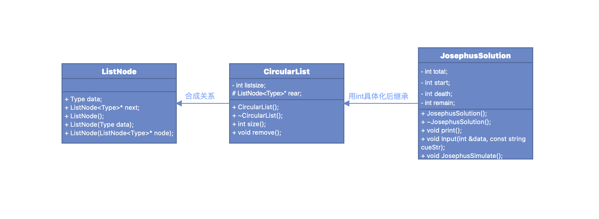
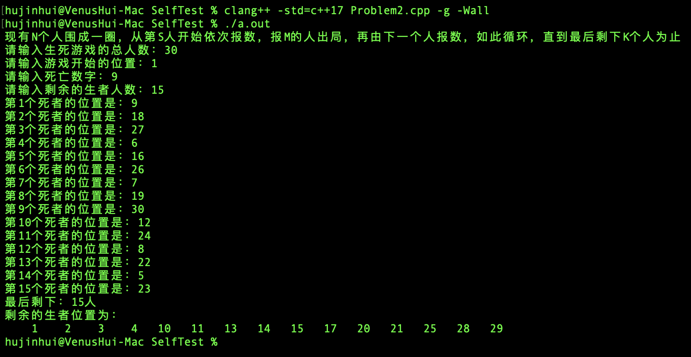

> version：1.0
>
> CopyRight：2053300 胡锦晖
>
> Process：已完成
>
> LastEdit：2021.11.15

## 项目名称：约瑟夫生者死者游戏

## 项目概述

### 项目背景

在一艘有N名旅客的船上，由于船严重超载，必须要抛下一些乘客，使船上只剩下K名乘客(K < N)。制定如下规则进行筛选：所有旅客围成一圈编号1-N，现从第S名旅客开始，按照编号递增的顺序从1开始报数，报到M的人被抛弃，然后从被抛弃的下一位开始重新从1开始报数，重复上述过程直到船上只剩下K个人为止。

### 项目目标

通过模拟方法找出所有需要抛弃的乘客的编号，并最后输出最后剩余的乘客编号。

## 项目概览

## 实现思路

- 数据的存储结构：按照题目要求，采用**单循环链表**模拟N名乘客围成一圈

- 类的设计及关系



## 核心代码

```cpp
int loop = total - remain;
for (int i = 1; i <= loop; i++)
{
    for (int j = 1; j < death; j++)
    {
        pre = prt;
        prt = prt->next;
    }
    pre->next = prt->next;
    cout << "第" << i << "个死者的位置是：" << prt->data << endl;
    delete prt;
    prt = pre->next;
}
cout << "最后剩下：" << remain << "人" << endl;
cout << "剩余的生者位置为：" << endl;
prt = rear;
for (int i = 0; i < remain; i++)
{
    cout << setw(5) << setfill(' ') << prt->data;
    prt = prt->next;
}
```

## 性能分析

- 单循环链表

    对于用单循环链表模拟的方法求解约瑟夫环的问题，虽然相较于普通单链表而言，具有向下枚举及删除结点不需要考虑头尾的优势，但由于  直接模拟了整个报数的循环过程，如果所给的死亡数字M远大于总人数N的话，在模拟的过程中会进行多次的整圈循环，所以可以用**求余**的方法计算等价的最低枚举次数。

    改进之后的代码为：

```cpp
for (int i = 1; i <= death % listSize; i++)
{
    pre = prt;
    prt = pre->next;
}
pre->next = prt->next;
// 输出死者位置
delete prt;
prt = pre->next;
listSize--;
```

- 有序集合模拟

    对于单循环链表的模拟方式，虽然通过**求余运算**避免了多次整圈循环的过程，但由于链表结构的限制，想要得到需要删除的节点，就必须从当前节点向下枚举得到，对于N值很大的情况，这一枚举过程仍然需要较大的时间开销。

- 递归公式

    观察数据之间的关系可以得到：

```cpp
f(n, m) = (f(n - 1, m) + m) % n;
f(n, m) // 指n个人，报第m个编号出列最终编号
```

## 测试

- MacOS下采用clang++的c++17标准编译测试结果如下



- Windows下采用gcc的c++17标准编译测试结果如下

