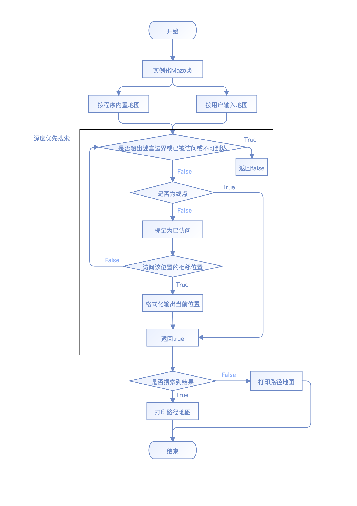

# 第三题 勇闯迷宫游戏

## 项目简介

存在一个迷宫，只有两个门与外界连通，分别为迷宫的入口与出口。迷宫中存在很多障碍，只有特定的路径可供行走。现有一名骑士从入口处进入迷宫，要求输出骑士从起点抵达终点的路径，并绘制路线图。

## 实现思路

-  首先考虑存储迷宫的数据结构

由于依照项目示例描述，该迷宫为一个**矩形**迷宫，所以考虑用一个`char`型的二维数组作为矩阵`MazeMap`来存储迷宫，`Mazemap[i][j]`中下标`i` `j`分别代表该位置在迷宫中的行号和列号，当该位置值为`'#'`时；表示此处为障碍，为`'0'`时表示此处为通路。

- 实现思路

可以参考Depth First Search的思想，从迷宫起点开始，在不遇到障碍或迷宫边界且当前位置未曾被搜索到的情况下，搜索当前位置的前后左右四个方向，直到某次搜索的位置为迷宫出口结束。

- 实现流程图

## 
