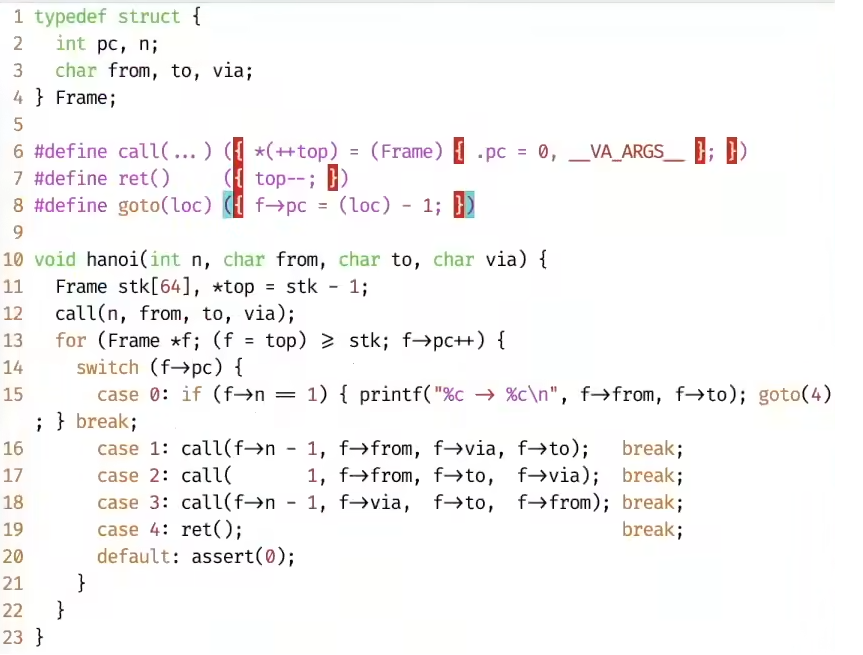

## 操作系统概述

### 什么是操作系统

make it easy to run programs, allowing programs to share memories

没有必要下一个严谨的定义（管理软硬件资源，为程序提供服务），边界模糊

## 操作系统上的程序

### 程序的状态机模型

#### 状态机与数字电路

- 数字逻辑电路
  - 状态：寄存器保存的值
  - 初始状态：RESET
  - 迁移：组合逻辑电路与计算寄存器下一周期的值

```c
// 数字逻辑电路处理器
#include <stdio.h>
#include <unistd.h>

#define REGS_FOREACH(_) _(X) _(Y)
#define RUN_LOGIC X1 = !X && Y; \
                  Y1 = !X && !Y;
#define DEFINE(X) static int X, X##1;
#define UPDATE(X) X = X##1;
#define PRINT(X) printf(#X" = %d; ", X);

int main() {
    REGS_FOREACH(DEFINE);
    while (1) {
        RUN_LOGIC;
        REGS_FOREACH(PRINT);
        REGS_FOREACH(UPDATE);
        putchar('\n'); sleep(1);
    }
    return 0;
}

// gcc -E testc.c
int main() {
    static int X, X1; static int Y, Y1;;
    while (1) {
        X1 = !X && Y; Y1 = !X && !Y;;
        printf("X"" = %d; ", X); printf("Y"" = %d; ", Y);;
        X = X1; Y = Y1;;
        putchar('\n'); sleep(1);
    }
    return 0;
}

```

### 什么是程序

#### 源代码视角（状态机）

数字系统是状态机，而程序是运行在数字系统上的，所以程序就是状态机

- C程序的状态机模型
  - 状态：堆 + 栈
    - 栈帧(stack frame)：每个栈帧内包含各项参数(args)以及(PC，当前执行到的位置)
    - 函数调用：push frame，函数返回：pop frame
  - 初始状态：main的第一条语句
  - 迁移：执行一条简单语句



#### 二进制视角/机器视角（还是状态机）

- 状态机模型
  - 状态：内存(M) + 寄存器(R)
  - 初始状态：无随机性的所有程序一致的初始状态
  - 迁移：执行一条指令

- 操作系统上的程序
  - 所有指令都只能计算
  - 系统调用(syscall)
    - 把(M, R)完全交给操作系统，任其修改
    - 实现了程序与操作系统中其他对象的交互

  - 程序 = 计算 + syscall

