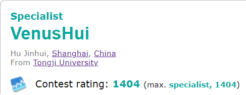
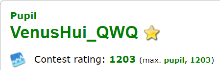
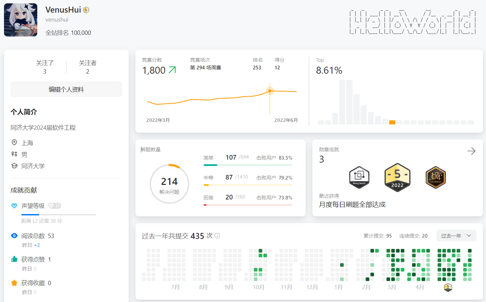
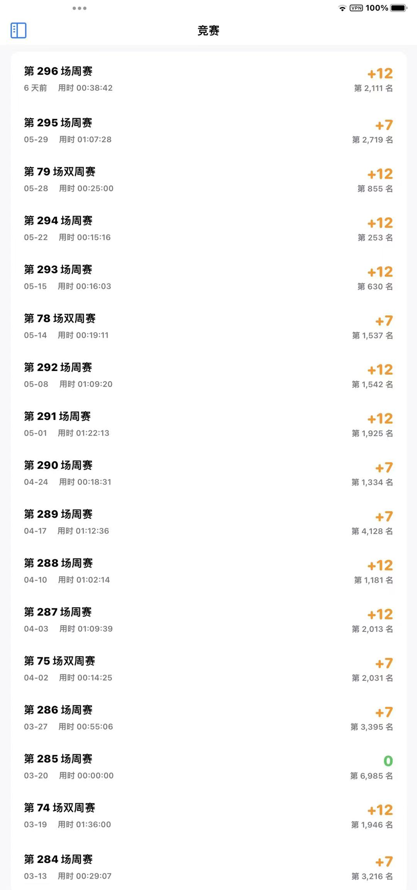

## 参与竞赛类别

目标是想好好训练看有没有机会参加下半年的ICPC/CCPC程序设计竞赛，这里就简单展示一下阶段性训练成果：

主要分为三个部分：

- [Codeforces](#1)

- [LeetCode](#2) 

- [其他](#3)

## 证明材料

### Codeforces

平时主要的训练平台之一在Codeforces上，目前有两个账号（哪个分低打哪个）

- 账号1链接：[VenusHui](https://codeforces.com/profile/VenusHui)
  - 

- 账号2链接：[VenusHui_QWQ](https://codeforces.com/profile/VenusHui_QWQ)
  - 

两个账号共计参加Codeforces平台自3月4日到6月11日共计30场竞赛（不包括Division1）中的28场，其中账号1参加24场，账号2参加4场。

具体的竞赛记录以及非赛时训练情况可以点击相应的账号链接进行查看。

### LeetCode

LeetCode（中文站）也是主要的训练平台之一：

账号链接：[VenusHui](https://leetcode.cn/u/venushui/)

共参与LeetCode平台3月13日到6月11日共计18场竞赛中的16场，由于只有移动端支持竞赛记录查询，故贴图如下：

### 其他

- 蓝桥杯
  - 奖项：上海赛区C/C++ A组省级一等奖
  - 

- 第19届同济大学程序设计竞赛
  - 奖项：校内三等奖（28/248）
  - [比赛排名链接](https://ac.nowcoder.com/acm/contest/34442#rank/%22searchUserName%22%3A%22%E5%90%8C%E6%B5%8E%E5%A4%A7%E5%AD%A6%22)
  - [校内获奖名单（电信学院官网）](https://see.tongji.edu.cn/info/1143/10156.htm)

- 其他

此外在AtCoder、Acwing、Nowcoder、LuoGU、Daimayuan等平台也跟了一些训练，就不再赘述了。

## 竞赛中提交的作品或作品初稿

所有训练以及比赛（除了蓝桥杯以及daimayuan平台）题目的代码全部都同步到下面的GitHub仓库中：

截止6月11日共计约有450题左右

- [仓库链接](https://github.com/VenusHui/VenusHui_code_record/tree/main/ACM-ICPC-Practice)

为方便查看我也将这些代码随附件一起提交至了canvas平台（其实没什么查看价值）