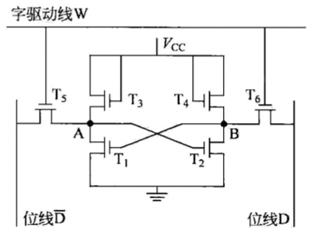
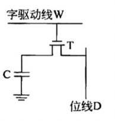

> writer: VenusHui
>  
> time: 2021.09.08
>  
> last edit: 2021.11.25
>
> Reference: 《计算机组成原理》

# 计算机组成原理

## 第一章 计算机系统概述

### 计算机系统 = 硬件 + 软件。

    软硬件的分界已经不明显

### 计算机系统的硬件组成

    主机系统 + I/O系统
    (CPU + 存储器) + (I/O设备)
    ((控制器 + 运算器) + 存储器) + (输入设备 + 输出设备)

* 冯·诺依曼结构
  + 存储程序原理：在计算机解题之前，要事先编制好程序，并与所需要的数据一起预先存入主存当中。

* 哈佛结构（现代常用）
  + 将程序与数据存储在两个不同的存储空间中，具有数据段和代码段两个通道。
  + 优势：在进行数据交互时，通常指进行数据段交互而代码段不变，提高数据交互效率。

* 运算部件
  + 组成：运算器 + 通用寄存器组(GPR)。运算器即算术逻辑单元(ALU)。

* 内存
  + 存储器 = 内存 + 外存。内存通常利用半导体技术实现，外存通常利用磁记录实现，如磁盘。
  + 内存：一个由大量存储空间构成的能按地址访问的一维线性空间。以字节编址或以字编址，字长与机器有关。

* 控制器
  + 指令寄存器：存放当前正在进行的指令
  + 程序计数器：存放当前正在进行的指令地址
  + 指令译码器：对指令进行译码，形成相应的控制信号
  + 时钟脉冲：
  + 时序信号发生器：
  + 微操作控制部件：微操作指硬件电路中不可再细分的简单操作

### 计算机的软件系统

### 计算机的性能指标

* 基本性能指标
  + 主频：
    - 时钟产生固定频率的时钟脉冲，这个时钟的频率即为主频。通常用一秒钟发出的电子脉冲数来表示。
    - 结构差距很大的机器之间通常不比较主频。
  + 运算速度：通常以每秒执行多少条指令或完成多少次浮点运算表示。
  + 基本字长：
    - 参与运算的数据字的二进制位数，决定了运算精度。
    - 决定了寄存器、ALU、数据总线等的位数，直接影响硬件的造价。
  + 主存容量
  + 主存存取周期：对主存连续访问两次所允许的最小时间间隔。

## 第二章 数制与编码

### 进位计数制与数制转换

* 小数转换在最后补0

### 带符号数的表示方法

* 原码

* 补码

* 移码：在浮点数据表示中，常使用移码表示阶码。
  + 移码与补码数值部分相同，符号位相反。
  + 目的：能够直接从机器数的形式上直接判断两数真值的大小

### 数的定点表示与浮点表示

* 数的浮点表示
  + 浮点数的一般表示形式：$X = M \times 2^E$，在计算机中，通常用$\overline{M_fE_fEM}$表示一个浮点数，其中$M_f$ $E_f$ $E$ $M$分别为数符、阶符、阶码、数码。

* IEEE 754标准
  + 两种基本浮点格式：单精度浮点格式及双精度浮点格式
  + 两种扩展浮点格式：扩展单精度格式及扩展双精度格式

### 常用的其他编码

* 十进制数的二进制编码
  + 8421(BCD)码
    - 是一种恒权码，用四位二进制数表示0-9，其中每一位的权值分别为8、4、2、1
    - 

  + 余3码
    - 是一种对9的自补码，每个余3码只要自身按位取反，便可以得到其对9的补码（此补码非彼补码）。
    - 对于同样的十进制数字，余3码比相应的BCD码多一个`0011`

  + 2421码

* 字符代码
  + 五单位字符代码
  + 七单位字符代码

* 可靠性编码
  + 格雷(Gray)码
  + 奇偶校验码
  + 海明检验码
  + 循环冗余校验码

## 第六章 计算机执行程序的过程

### 指令

* 立即数：通常是指在立即寻址方式指令中给出的数。可以是8位、16位或32位，该数值紧跟在操作码之后。

* 寻址方式：
  + 直接寻址：
  + 间接寻址：

* `Load R1, 200(R0)`装载寄存器指令（来自存储器的某单元）
  + 计算访存地址：`R0 + 200`
  + 从存储器读出数据送入`R1`

* `Load R1, #1`装载寄存器指令（`#`代表来自立即数）
  + 直接将`IR`中的操作数送入`R1`。

* `ADD R3, R1, R2`加法指令
  + 将`R1`和`R2`的内容送到`ALU`，运算结果送到`R3`。

* `Store R1 200(R2)`存储指令（直接寻址）
  + 计算访存地址放入`R2 + 200 -> AR`
  + 将`R3`中的数据送入`DR`
  + 将`DR`中的数据写入地址为`[AR]`的内存中去。

* `Store R1 @(200)`存储指令（`@`表示间接寻址）
  + 访问存储器，将`MEM[200]`的内容放入`DR`。
  + 将`DR`中的内容放入`AR`（间接寻址的过程）。
  + 将`R1`中的数据送入`DR`。
  + 将`DR`中的数据写入地址为`[AR]`的内存中去。

### 指令的执行过程

* 取址
  + `[PC]->AR`：将程序计数器`PC`的内容传送到内存的地址寄存器`AR`。
  + 从存储器读出第一条指令，放到数据寄存器`DR`当中。
  + 把该指令从`DR`送到指令寄存器`IR`之中。

* 译码
  + 指令寄存器进行[译码]()。

* [指令执行](#指令)

* `PC`中的地址递增，指向下一条指令。

## 第七章 指令系统

### 指令格式

* 每条指令需要包含：
  + 要执行的操作
  + 操作数的来源
  + 操作结果的取向

* 指令的地址码`A`
  + 零地址指令：`OP`
    - 空操作或停机操作。
    - 指令中需要的操作数是隐含指定的，如堆栈操作。
  + 一地址指令：`OP` `A`
    - 只需要一个操作数：`A <- OP[A]`
    - 需要两个操作数：指令中指明一个操作数，另一个操作数载默认的累加器`AC`中，操作结果存放到累加器`AC`中，即`AC <- [AC]OP[A]`
  + 二地址指令：`OP` `A1` `A2`
    - `A1 <- [A1]OP[A2]`
  + 三地址指令：`OP` `A3` `A1` `A2`
    - `A3 <- [A1]OP[A2]`

* 指令的操作码
  + 固定长度操作码
  + 可变长度操作码
  + 扩展操作技术
    - **等长扩展**：操作码分别为4、8、12···位
    - 不等长扩展

* 指令长度
  + 一般来说指令长度即为机器字长（单字长指令）
  + 同时也存在半字长指令，双字长指令。

### 数据类型

* 数据表示和数据结构
  + 数据表示是指计算机硬件能够直接识别、指令系统可以直接调用的数据类型，一般有定点数（整数）、布尔数、浮点数、字符和字符串等。
  + 数据结构是指由软件进行处理和实现各种数据类型，研究逻辑结构与物理结构之间的关系并给出相应算法。
  
* 表示操作数类型的方法
  + 由指令中的操作码确定操作数的类型
    - 对于同一种运算，对于不同的操作数类型有不同的操作码，如整数加，浮点加，无符号数加法等。
    - 绝大多数机器采用这种方法。

  + 给数据加上标识符，由数据本身给出操作数类型。
    - 可以简化机器的指令系统，由硬件自动实现一致性检查和类型转换，简化编译器。
    - 需要在程序执行过程中动态检测标识符，动态开销过大。

### 寻址方式

   执行一条指令所需要的操作数可能在主存中，可能在某个寄存器中，也可能在本指令的字中。

* 直接寻址方式：形式地址就是有效地址

* 间接寻址方式：形式地址所指向的内存中存有有效地址

* 立即寻址方式：地址码字段就是操作数本身

* 寄存器的直接寻址与寄存器的间接寻址

* 隐含寻址方式

* 相对寻址方式
  + 常用于跳转指令
  + 将程序计数器`PC`中的内容与指令中给出的形式地址的值相加形成有效地址。
  + 这里程序计数器`PC`的值通常不变，改变的是指令中的形式地址。

* 变址寻址方式
  + 常用于字符串的处理以及数组的运算，解决程序循环控制等问题
  + 将变址寄存器中的值与指令中给出的形式地址的值相加形成有效地址。
  + 与相对寻址方式不同，这里通常改变的量为变址寄存器`Rx`的值。

* 基址寻址方式

* “基址+变址”寻址方式

### 指令系统的设计

### 指令系统的发展和改进

   强化指令功能，实现软件功能向硬件功能转移：复杂指令系统计算机(CISC)
   降低指令系统的复杂性，达到简化实现，提高性能的目的：精简指令系统计算机(RISC)

* CISC方向
  + 各种指令的使用频度相差悬殊，许多指令很少用到（二八原则）。
  + 控制器硬件非常复杂：占用大量芯片面积、增加研制时间及成本。
  + CPI值较大，执行速度慢。
  + 指令功能复杂，规整性不好，不利于采用流水技术来提高性能。

* RISC方向
  + 只选取使用频度高的指令，在此基础上补充一些最有用的指令。
  + 采用简单而同意的指令格式，减少寻址方式，指令字长均为32/64位。
  + 指令的执行在单周期内完成。
  + 采用load-store结构。
  + 大多数指令采用硬连逻辑实现。
  + 强调优化编译器的作用，为高级语言程序生成优化的代码。
  + 充分利用流水技术来提高性能。

### 案例：MIPS指令系统

* MIPS的寄存器
  + GPRs：32个64位通用寄存器，`R0`的值永远为0。
  + FPRs：32个64位浮点数寄存器。
  + 另外还有一些特殊的寄存器，如浮点状态寄存器

* MIPS的数据表示
  + 整数：字节、半字、字、双字（采用零扩展或符号位扩展）
  + 浮点数：单精度浮点数、双精度浮点数

* MIPS的数据寻址方式

* MIPS的指令格式
  + I类指令：[R]<->[M]
  + R类指令：[R]<->[R]
  + J类指令：跳转指令

* MIPS的操作
  + load-store操作
  + ALU操作
  + 分支与跳转
  + 浮点操作

## 第八章 中央处理器(CPU)

   由算数逻辑运算单元(ALU)、通用寄存器组和控制器组成。

### CPU的组成与功能

* CPU的功能：
  + 指令顺序的控制
  + 操作控制
  + 时间控制
  + 数据加工

* CPU的基本组成：
  + 现代CPU一般由运算器、控制器、数据通路和Cache组成

### 关于模型机（MIPS结构的简单实现）

* 指令系统
  + 字长：4字节
    - 算术逻辑运算指令（R类指令）：`OP = 0`
    - 存储器访问指令（I类指令）：`lw, OP = 35` `sw, OP = 43`
    - 等于‘0’分支：`beqz, OP = 63`

  + R类指令：`OP[31:26]rs[25:21]rt[20:16]rd[15:11]shamt[10:6]funct[5:0]`
    - rs,rt：操作数所在寄存器
    - rd：目标寄存器
    - shamt：为空，无用
    - funct：ALU的指令运算函数码字段（OP相等时用funct区分功能）

  + I类指令：`OP[21:26]rs[25:21]rt[20:16]adr[15:0]`
    - rs：基址寄存器
    - rt：目标寄存器
    - adr：偏移量

### 逻辑设计的约定和定时方法

### 实现MIPS的一个基本方案

* 构建基本数据通路

* ALU控制器
  + 两级控制：主控制器产生的`ALUOP`信号控制**ALU控制器**，ALU控制器的输出（即**ALU控制码**）控制ALU。使用多级控制可以减少主控制器的规模和复杂度

* 单周期数据路径的控制器
  + 一条指令执行所用的时钟脉冲个数称为该指令的执行周期

* 多周期实现方案
  + 提高并发度：单周期方案的周期时间只能取最长数据通路所花的时间，造成性能损失；多周期方案的可以采用更短的时钟周期，同时允许指令执行时间为多个时钟周期（通常为一个基本部件的延时时间）

### 流水线技术

    单周期-> 多周期-> 流水线
    多周期方案的高效性要在流水线技术中才能很好的体现。

* 流水线技术的特点
  + 流水线实际上是把一个大的处理部件分解为多个独立的功能部件（成为流水线的*级*或*段*），并依靠他们的**并行**工作来提高吞吐率。
  + 各段时间应尽可能相等，否则容易引起阻塞和断流。
  + 适合于大量重复的时序性工作。
  + 流水寄存器：在相邻两段之间传输数据并隔离各段的处理工作，不一定是一个寄存器，可能是一些寄存器的组合
  + 通过时间和排空时间。

* 性能指标
  + 吞吐率(TP)：单位时间内完成任务的数量。
  + 加速比：对于同一批任务，不使用和使用流水线技术所用的事件之比。
  + 效率：设备实际使用时间与整个运行时间的比值。

 `Crush Course Begain`

* 流水线处理器首先要弄清数据依赖性，必要时需要停止流水线以免出现问题。
  + 乱序执行：动态排序有依赖关系的指令，最小化流水线的停工时间。
  + 推测执行、分支预测：现代处理器在遇到`JUMP`指令之后会推测之后执行哪条指令的可能性更大一些，然后将其提前放入流水线，等JUMP的结果出了之后，如果与推测一致，则可以立即执行流水线中已经填充好的所有正确指令，反之则需要清空流水线。
  

## 第九章 微程序控制器

### 微程序控制器的基本原理

* 组合逻辑控制器的缺陷：
  + 设计复杂繁琐，设计效率低
  + 不易修改和扩展，缺乏灵活性

* 微程序控制的缺陷
  + 运行速度较组合逻辑控制器慢，顾RISC经典指令集还是由传统的硬连逻辑设计。

* 用二进制编码字（称为**微指令字**）来代替组合逻辑控制器中微操作控制信号的产生，即将微指令字中的每一位与相应的控制信号相连。

* 基本概念
  + 微命令和微操作：微命令是构成控制信号序列的最小单位；微操作是接收到微命令之后不可再细分的操作（相容/互斥）。
  + 微指令和微程序：微指令是用来产生微控制信号的二进制编码字；微程序是一序列微指令构成的有序集合。每一条机器指令都对应一段微程序（等效于一段组合逻辑控制电路）。
  + 微指令周期：微程序控制器的工作周期。

### 微程序控制器的组成与工作过程

* 组成
  + 控制存储器(CM)：简称控存，用于存放实现整个指令系统需要的所有微程序（只读、快速）
  + 微指令寄存器(µIR)：
  + 微地址形成电路
  + 微地址寄存器
  + 地址译码器

### 微程序设计技术

* 编码方法
  + 直接编码方式：结构简单，并行性好，操作速度最快；但需要的存储空间较大。
  + 最短字长编码方式：微指令字长最短，但需要进行译码，执行速度受到影响，且无法利用硬件所具有的并行性。
  + 字段直接编码：字段之间是并行的直接编码方式，字段内部是最短字长的编码方式。
  + 字段间接编码
  + 常数源字段的设置

#### 微指令格式

* 水平型微指令：一次能定义并执行多个微操作的微指令。
  + 优点：描述并行微操作的能力强，指令译码简单。
  + 缺点：指令较长，明显增加了控存的宽度。

* 垂直型微指令：一次只能定义一两个微操作（一般是数据传送）。
  + 指令格式`µOP` `R1` `R2` `R3` `else`

#### 微程序的顺序控制

在一条机器指令的执行过程中，微程序控制器需要确定初始微地址以及（形成）后继微地址（下地址）。

* 微程序的入口地址（初始微地址）的形成
  + 取址[公共]：一般放在控存中0号单元开始的一片控存区域中。
  + 根据`IR`中的`OP`找到对应微程序的初始微地址。对于操作码相同的不同指令，可以通过`ROM散转`的方法进行细分。

  + 直接对应法：`const | OP` const为基址，OP为偏移量。

  + 查表法

* 后继微地址的形成

  + 增量方式：在微程序控制器中增加`µPC`，顺序执行时`µPC`递增，需要跳转时由微指令给出转移目标的微地址。
    - 指令格式：`µOCF` `BCF` `BAF`，其中微地址字段SCF分为转移控制字段BCF（规定顺序执行还是转移）和转移地址字段BAF（转移地址），转移地址可能由BAF给出、机器指令所对应的微程序入口地址或微子程序入口地址和返回地址给出。
    - 优点：后续地址生成逻辑简单，编制微程序较为容易。
    - 缺点：不能直接实现多路转移。

  + 断定方式：后继微地址由微程序设计者指定或由指定的测试判别逻辑字段控制产生，即由SCF字段直接生成。
    - 指令格式：`µOCF` `SCF`，其中`SCF = 非测试地址HF + 测试地址TC`，其中HF，TC的位数不固定，最终的后继地址为`HF` `TF`，TF即由TC生成的，TC有n位，就能实现$2^n$路的并行转移功能。
    - 优点：实现快速的多路转移，提高微程序的执行速度，且微程序在控存中的存放也很灵活（不再受顺序存放的约束）。
    - 缺点：生成方法复杂，执行顺序不直观。

* 设计时可以留出一个空位。

### 模型机的微程序控制器

#### 模型机的微指令格式

`ALUCtrl`  `SRC1`  `SRC2`  `RegCtrl`  `MemCtrl`  `PCCtrl`  `IRWrite`  `Sequening`

* 确定下一条微指令的三种方法
  + `Sequening = Seq`，顺序执行，即当前微指令地址加1。
  + `Sequening - Fetch`，转移到取指令的公共入口。当执行完一条指令对应的微程序后，转移到公共入口进行取址。
  + 根据操作码散转到该指令的入口。为减少微程序所占的空间，一般采用两级散转，即`Sequening = Dispatch1`先散转到相关的一类指令的公共操作的微程序入口，待公共操作完成后，`Sequening = Dispatch2`再散转到具体指令的微程序入口。

## 第十章 运算方法与运算器

将各种复杂的运算分解为最简单的算术运算和逻辑运算

### 移位运算

* 逻辑移位
  - 
* 循环移位：将要移出的数据移入另一端。
* 算术移位
  + 原码算术移位：符号位不参加移位，移入的数据为0。
  + 补码算术移位：符号位参加移位。
  + 反码算术移位：

### 定点数的加减法运算

### 定点数的乘除法运算

### 定点运算器的构成

### 浮点运算

#### 浮点加减法运算

* 判0操作：检测两个操作数中书否有为0的，若有则可直接输出结果，否则进入下一步。

* 对阶：即将两个浮点数的小数点对齐的过程。
  + 求阶差$∆_E = X_E - Y_E$，若$∆_E = 0$，则X、Y阶码相等。
  + 若$∆_E > 0$，即X的阶码大于Y的阶码，此时需要将Y的尾数右移，每右移一位，阶码$Y_E + 1$，直到X、Y的阶码相等为止。
  + 若$∆_E < 0$，即X的阶码小于Y的阶码，此时需要将X的尾数右移，每右移一位，阶码$X_E + 1$，直到X、Y的阶码相等为止。

* 尾数加/减：将X、Y的尾数按照定点加减运算的规则进行加减法运算，得到结果的尾数。

## 第十一章 存储器

### 存储子系统概述

### 主存储器

### 随机存储器

#### 静态随机存储器(SRAM)

* 利用触发器来存储二进制信息，只要不断电，信息便不会丢失。
* 存储位元电路：存储一位二进制信息的电路。

  

  + 保持：触发器本身具有两个稳定状态，在门控管T5，T6都处于截止状态时，两根位线与触发器之间无联系，及存储的二进制信息不变。
    T5，T6均导通：

  + 写入操作：写入“1”时，位线D为高电位，即A点为低电位->T2截止，B点为高电位->T1打开，保存信息“1”；写入“0”时对称操作。

  + 读操作：根据所存储的信息，T1，T2的状态->A，B点的电位->位线D的电位->读出信息，且独处过程中并没有破坏触发器的状态，是非破坏性读出，读操作后不需要进行恢复工作。

* 缺点：基本存储位元所含的晶体管多，集成度较低且功耗较大。

* 优点：工作速度快且稳定可靠，且由于非破坏性读出的特性无需外加刷新电路，通常用于做高速缓存。

#### 动态随机存储器(DRAM->DDR*)

* 利用MOS晶体管的管极电容来存储二进制信息，电容上有电荷/无电荷分别代表二进制1/0。

  

  + 保持：T处于截止状态，电容C中的电荷不变，即保存的信息不变。
    T处于导通状态时：

  + 写入操作：在位线D上加高/低电位，写入信息“1”/“0”。
  
  + 读操作：原存信息为“0”时，电容C上几乎无电荷，位线为D为低电位，读出信息“0”；原存信息为“1”时，电容C上的电荷通过T输出到位线D上，位线D为高电位，读出信息“1”。但可以看到在读出“1”时电容电荷在逐渐释放，当读取时间长/读取次数多时，“1”可能会变为“0”，这种读操作称为破坏性读出，需要外加刷新电路。

* 优点：基本存储位元的晶体管数目少，集成度较高，成本低，功耗小。

* 缺点：由于外加刷新电路使得工作速度比SRAM慢得多，一般用作内存。

### RAM芯片

#### 存储芯片内部组成

  二维结构

#### RAM芯片

* 静态RAM芯片：Intel2114

* 动态RAM芯片：Intel2116
  + 内部存储位元排列为128*128的方阵，共16K个存储单元。
  + 采用地址复用技术，分两次将14位地址送入芯片。

#### 动态RAM的刷新

  + 刷新间隔通常取决于电容电荷的泄漏速度，通常为2ms、4ms、8ms或更长。

* 集中式刷新：在一个刷新周期内，集中一段时间对全部存储单元逐行刷新一遍，在刷新操作期间，不允许CPU对存储器进行正常访问。
  + 读写操作时不受刷新工作的影响，但集中刷新时间必须停止读写，且存储容量越大，“死区”越长。

* 分散式刷新：每次进行存取操作后都进行一次刷新。

* 异步式刷新（常用）：对于Intel2116芯片若需要2ms将128行全部刷新一遍，则相邻两行的刷新间隔为2ms/128。

### 主存的设计

* 位扩展法
  + 在位数方向扩展，增加存储字长
  + 连接方式：将各存储芯片的地址线、片选线、读写线并联；各数据线单独引出。

* 字扩展法：
  + 在字数方向扩展，位数不变
  + 连接方式：地址线、数据线、读写线并联，由片选线来区分各个芯片（配合译码器选择）。

  + 高位交叉：选择高位地址形成片选线，这样同一芯片中的所有存储单元在存储器中方的地址是连续的。

* 字和位同时扩展
  + 组内进行位扩展，组与组之间进行字扩展
